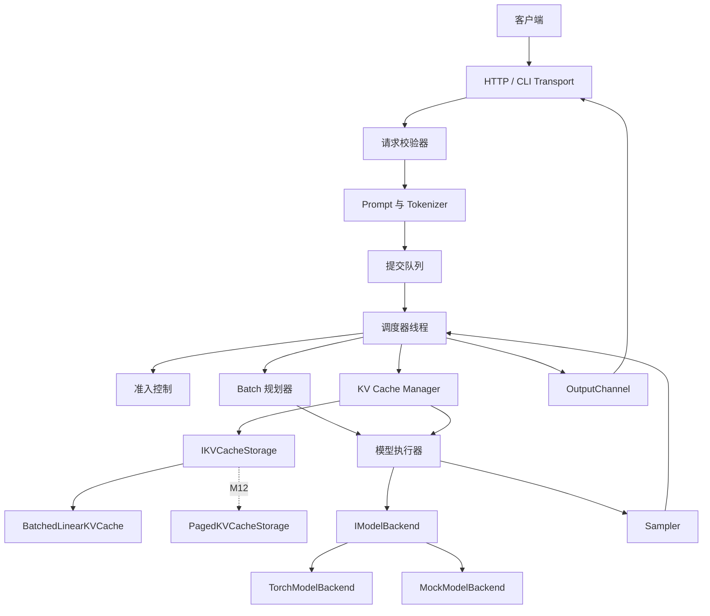
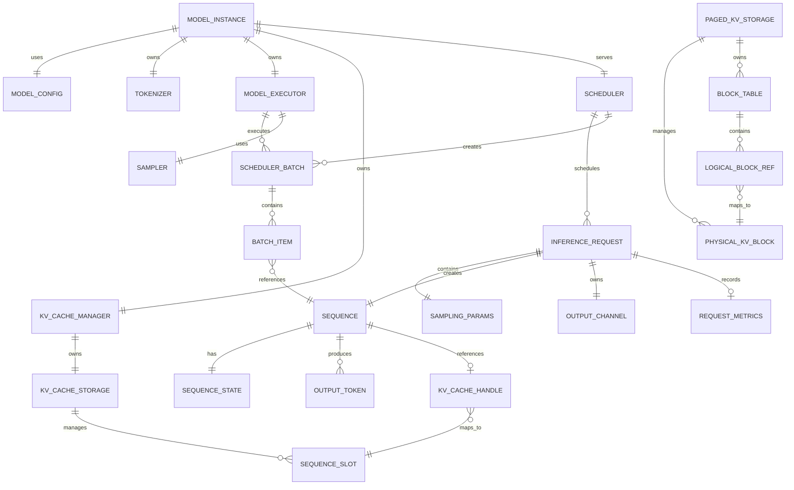
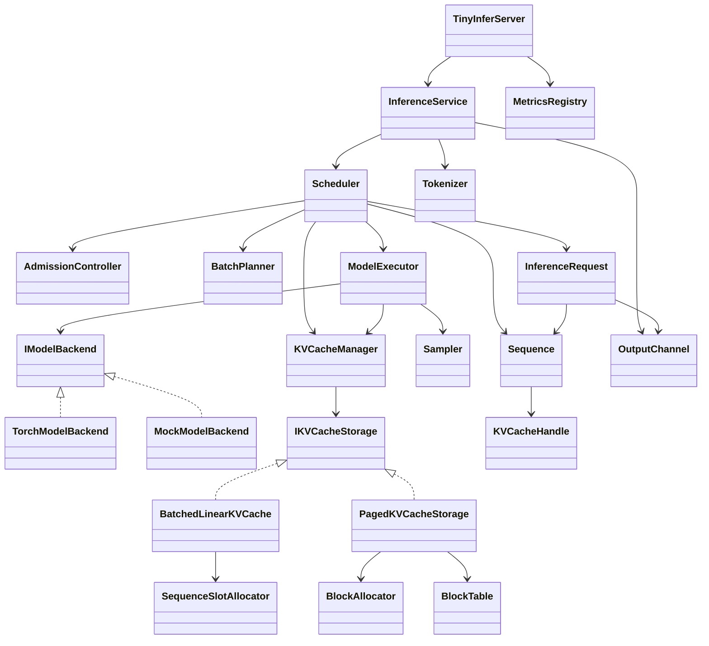
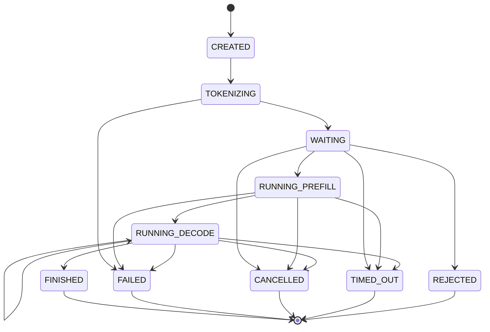
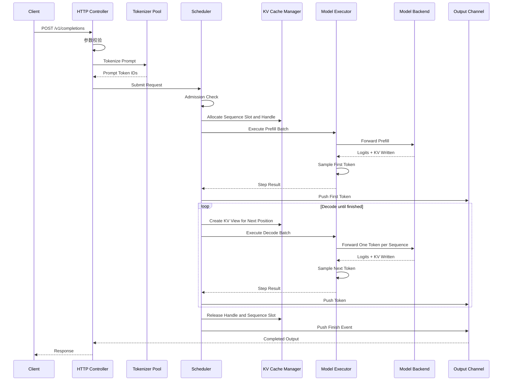
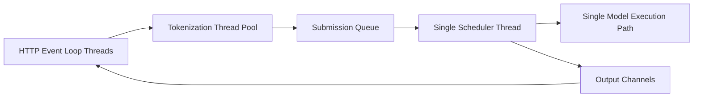

# TinyInfer：单机多请求 LLM 推理框架设计文档

> 文档版本：v1.1  
> 实现语言：C++20  
> 项目目标：实现一个可运行、可测试、可扩展的教学型 LLM 推理框架，覆盖模型执行、单请求推理、多请求调度、Continuous Batching、线性 KV Cache 管理、流式服务，不包含分布式推理。  
> 修订原则：真实模型路径先完成连续线性 KV Cache；逻辑分页与 BlockTable 后置为进阶实验，不作为第三层完成前置条件。

---

## v1.1 修订摘要

本版本对真实执行面的施工顺序做了结构性调整：

1. 第三层基准实现改为 `BatchedLinearKVCache`，使用固定 Sequence Slot 和连续上下文维度。
2. `BlockAllocator`、`BlockTable`、`SlotMapping`、分页 Gather Attention 移至第三层完成后的 M12 进阶实验。
3. M8 只完成单请求线性 KV；M9 完成真实多请求 Batch 并先通过 CLI/测试驱动联调；M10 才接入真实 HTTP/SSE。
4. Chunked Prefill 独立为 M11，并要求验证 position、RoPE、mask、历史长度和 Chunk 边界。
5. LibTorch 仅由独立 Torch Target 链接，ABI 必须匹配实际发行包，不允许全局硬编码 ABI 宏。
6. CPU Reference Backend 默认使用 FP32 KV；FP16/BF16 仅在 CUDA 增强阶段验证。
7. Top-P 必须按真实语义实现，不能用 Top-K 替代。
8. MockBackend 增加延迟、错误、OOM、EOS 和固定 Token 序列注入能力；压力验收改为生命周期与资源不变量。

---

## 目录

1. [项目定位](#1-项目定位)
2. [目标与完成标准](#2-目标与完成标准)
3. [范围与非目标](#3-范围与非目标)
4. [总体技术选型](#4-总体技术选型)
5. [核心设计原则](#5-核心设计原则)
6. [系统总体架构](#6-系统总体架构)
7. [领域实体与 ER 关系图](#7-领域实体与-er-关系图)
8. [核心状态机](#8-核心状态机)
9. [完整请求执行流程](#9-完整请求执行流程)
10. [目录架构](#10-目录架构)
11. [模块与类设计](#11-模块与类设计)
12. [模型执行层设计](#12-模型执行层设计)
13. [KV Cache 设计](#13-kv-cache-设计)
14. [调度器设计](#14-调度器设计)
15. [Batch 设计](#15-batch-设计)
16. [采样器设计](#16-采样器设计)
17. [Tokenizer 与 Prompt 设计](#17-tokenizer-与-prompt-设计)
18. [HTTP 与流式服务设计](#18-http-与流式服务设计)
19. [并发与线程模型](#19-并发与线程模型)
20. [取消、超时与错误处理](#20-取消超时与错误处理)
21. [配置系统](#21-配置系统)
22. [日志、指标与可观测性](#22-日志指标与可观测性)
23. [测试策略](#23-测试策略)
24. [构建、依赖与开发环境](#24-构建依赖与开发环境)
25. [分阶段实施计划](#25-分阶段实施计划)
26. [里程碑验收标准](#26-里程碑验收标准)
27. [主要风险与降级方案](#27-主要风险与降级方案)
28. [未来扩展边界](#28-未来扩展边界)
29. [推荐施工顺序](#29-推荐施工顺序)
30. [最终交付物清单](#30-最终交付物清单)

---

# 1. 项目定位

TinyInfer 是一个教学型、单机、面向 Decoder-only Transformer 的推理框架。

它不是一个模型训练框架，也不是一个完整复刻 vLLM 的工业项目。它要解决的问题是：

1. 将已经训练好的小型 Decoder-only Transformer 模型加载到进程中。
2. 支持 Prompt 的 Prefill。
3. 支持基于 KV Cache 的逐 Token Decode。
4. 支持单请求流式生成。
5. 支持多个请求并发进入系统。
6. 通过调度器组成动态 Batch。
7. 支持 Continuous Batching。
8. 管理请求生命周期和 KV Cache 生命周期。
9. 提供一个可实际调用的 HTTP API。
10. 保留未来扩展 CUDA Backend、Prefix Cache、量化和多 GPU 的接口边界。

项目重点不是追求绝对性能，而是建立正确、完整、可测量的推理框架抽象。

TinyInfer 最终应能够回答以下工程问题：

- 请求如何进入系统？
- Prompt 在什么时候被 Tokenize？
- Prefill 和 Decode 有什么区别？
- 调度器如何选择下一轮运行哪些请求？
- Batch 如何组织？
- KV Cache 如何分配、增长和释放？
- 请求如何流式返回 Token？
- 某个请求取消后，系统如何停止计算并回收资源？
- 为什么吞吐量、首 Token 延迟和逐 Token 延迟存在冲突？
- 如何用测试验证调度器和缓存管理器没有资源泄漏？

---

# 2. 目标与完成标准

## 2.1 第一层：模型能运行

实现以下能力：

- 加载一个固定架构的小型 Llama-like 模型。
- 完成 Token Embedding、RMSNorm、RoPE、Self-Attention、MLP、LM Head。
- 输入 Token IDs，输出 logits。
- 支持 Greedy、Temperature、Top-K、Top-P 采样。
- 支持基础停止条件。

完成标准：

- 给定固定输入和固定随机种子，输出可重复。
- 与 Python 参考实现逐层对比，最终 logits 误差在设定容差内。
- 能在 CPU 上完成小模型推理。
- 模型推理入口使用 `model.eval()` 和 `c10::InferenceMode`，不构建 Autograd 图。

## 2.2 第二层：单请求推理引擎

实现以下能力：

- Prefill 与 Decode 分离。
- 使用物理连续的 `SingleSequenceKVCache` 保存历史 K/V。
- 每次 Decode 只输入新增 Token。
- 支持 CLI 流式输出。
- 支持 max_tokens、stop_token、EOS、取消、超时。
- 支持请求级统计。

完成标准：

- 长 Prompt 不会在每个 Decode 步骤被重复计算。
- 无缓存全量 Forward 与 Prefill + Decode 的每步 logits 在容差内一致。
- 输出 Token 可以逐步返回。
- 请求结束后 KV Cache 句柄失效，存储被完整释放或复用。
- 中途取消后不再继续生成。

## 2.3 第三层：多请求推理服务

实现以下能力：

- 多个请求同时进入等待队列。
- 调度器统一维护等待、运行和结束状态。
- 支持 Prefill Batch 和 Decode Batch。
- 支持 Continuous Batching。
- 使用 `BatchedLinearKVCache` 为活跃 Sequence 分配固定 Slot。
- 支持 Sequence Slot 容量控制和请求准入。
- 支持请求优先级和基本公平性。
- 支持 HTTP/SSE 流式接口。
- 支持系统指标。
- 支持 Chunked Prefill，并有数值等价测试。

完成标准：

- 一个长请求运行期间，新请求可以进入系统。
- 已完成请求可以立即退出 Batch，新请求可以补入。
- 不同长度请求不会被固定 Batch 最长请求永久阻塞。
- 多请求运行过程中不存在 Sequence Slot、KV Cache 或请求对象泄漏。
- 同一输入在离线单请求路径、Scheduler + CLI 路径、HTTP 路径的结果一致。
- 在固定硬件和模型下，可以测量吞吐量、TTFT 和 TPOT。

## 2.4 进阶分页实验

第三层完成后再实现：

- `BlockAllocator`、`BlockTable`、`SlotMapping`。
- `PagedKVCacheStorage` Reference Backend。
- 通过 Gather/拼接验证非连续 Block 的逻辑正确性。

该实验用于学习分页式 KV 管理，不属于第三层完成条件，也不宣称具有 PagedAttention 性能。

# 3. 范围与非目标

## 3.1 必须实现

- 单机进程、C++20、Decoder-only Transformer。
- 一个固定的 Llama-like 模型架构。
- CPU Reference Backend；可选 LibTorch CUDA Device。
- 单请求生成、连续线性 KV Cache。
- 多请求固定 Slot KV Cache。
- 多请求调度、Continuous Batching、Chunked Prefill。
- CLI Completion、HTTP API、SSE 流式响应。
- 单元测试、数值对照测试、集成测试、压力测试。
- 基础指标与结构化日志。

## 3.2 进阶但非第三层前置

- 逻辑分页 KV Cache。
- BlockAllocator、BlockTable、SlotMapping。
- Gather 型 Paged KV Reference Backend。
- LibTorch CUDA Device。
- FP16/BF16 推理与 KV Cache。

## 3.3 明确不做

- 多机分布式推理、Tensor/Pipeline/Expert Parallel。
- 自研 CUDA Kernel 或 PagedAttention 专用 Kernel。
- MoE、Encoder-Decoder、多模态模型。
- Beam Search、Speculative Decoding、动态 LoRA。
- 量化训练、生产级鉴权计费与高可用。
- CPU Swap、SSD KV Cache、自动模型分片。

## 3.4 第一版性能定位

优先级为：正确性、边界清晰、可测试性、可观测性、可运行性、性能。

`BatchedLinearKVCache` 为每个活跃 Sequence 预留完整最大上下文，存在明显内部碎片。这是有意接受的教学型降级，用来换取直接稳定的 Tensor 布局、无 Block Gather 的真实 Batch 路径和较低的数值调试难度。该缺陷同时构成 M12 分页实验的明确动机。

项目不以超过 llama.cpp、vLLM、SGLang 为目标。

# 4. 总体技术选型

## 4.1 语言与构建

- C++ 标准：C++20。
- 构建系统：CMake 3.25 以上。
- 包管理：优先 vcpkg；无法覆盖的依赖通过 CMake FetchContent 或手工配置。
- 编译器：Clang 16+ 或 GCC 13+。
- 测试：GoogleTest。
- 静态检查：clang-tidy。
- 格式化：clang-format。
- Sanitizer：ASan、UBSan、TSan 分配置运行。

## 4.2 张量与模型计算

第一版使用 LibTorch，原因如下：

- C++ 原生 API。
- 支持 CPU 和 CUDA Device。
- 提供 Tensor、矩阵乘法、Softmax、Embedding、归一化等基础算子。
- 避免第一阶段进入自研 Tensor Runtime 和 CUDA Kernel。
- 仍然允许项目自己实现 Transformer 结构、KV Cache、Batch 和调度。

LibTorch 在本项目中只承担张量运算，不承担请求调度和服务框架。

### 4.2.1 LibTorch 隔离与 ABI 规则

- `tinyinfer_core`、`tinyinfer_scheduler`、`tinyinfer_cache` 不链接 LibTorch。
- 只有 `tinyinfer_backend_torch` 和相关数值测试 Target 使用 `find_package(Torch)`。
- Torch Target 使用实际发行包提供的 `TORCH_CXX_FLAGS`。
- 禁止在根 CMake 中全局硬编码 `_GLIBCXX_USE_CXX11_ABI=0` 或 `=1`。
- CPU 第一版固定一个经过验证的 LibTorch 版本和发行包；禁止 Debug/Release 二进制混用。
- 构建阶段先运行最小 Tensor Smoke Test，再构建完整 Torch Backend。
- CUDA 发行包、驱动与 Toolkit 兼容性仅在可选 CUDA 里程碑处理。

## 4.3 模型权重格式

推荐顺序：

1. 第一阶段使用项目自带的小型随机权重或测试权重。
2. 第二阶段支持 SafeTensors。
3. 模型配置使用 JSON。
4. Tokenizer 使用 SentencePiece 或 tokenizers-cpp。

模型目录建议包含：

```text
model/
├── config.json
├── tokenizer.model 或 tokenizer.json
├── model.safetensors
└── generation_config.json
```

## 4.4 HTTP 服务

第一版使用 Drogon，原因：

- C++ 原生异步 HTTP。
- 路由、连接生命周期和流式响应能力完整。
- 可避免项目将大量时间消耗在 HTTP 协议细节上。

Drogon 只属于 Transport 层。必须遵守以下边界：

- Controller 只解析请求并调用 `InferenceService`。
- IO 线程只向 Scheduler 的提交队列或取消队列写入命令。
- SSE Writer 只消费 `OutputChannel`。
- 断连回调不能直接修改 RequestState、Sequence、KV Cache 或 Scheduler 容器。
- HTTP 回调不得持有 Scheduler 内部锁。

CLI 和 Embedded Engine 必须先于真实 HTTP 后端完成。真实模型数值联调不得依赖 HTTP。

## 4.5 日志与配置

- 日志：spdlog。
- JSON：nlohmann/json。
- 命令行：CLI11。
- 指标：自定义 MetricsRegistry，输出 Prometheus 文本格式。

## 4.6 并发原语

- `std::jthread`。
- `std::stop_token`。
- `std::mutex`、`std::condition_variable`。
- 有界阻塞队列。
- 原子计数器用于指标。

第一版不引入复杂无锁队列。

---

# 5. 核心设计原则

## 5.1 单一所有权

调度线程是请求运行状态、Sequence 状态和 KV Cache 分配状态的唯一写入者。

API 线程只负责：

- 解析请求。
- 校验参数。
- 创建请求对象。
- 将请求放入提交队列。
- 读取输出通道。

这样可以避免多个线程同时修改同一请求的状态。

## 5.2 控制面与执行面分离

控制面包括：

- 请求状态。
- 调度策略。
- Batch 规划。
- KV Cache Handle 与 Sequence Slot 分配。
- 取消与超时。

执行面包括：

- Tensor 构造。
- 模型 Forward。
- logits 输出。
- 采样。
- KV 写入。

调度器不直接实现模型数学计算，模型执行器不决定谁先运行。

## 5.3 先正确，再优化

真实模型路径严格分为三步：

1. `SingleSequenceKVCache`：单请求连续缓存，验证 Prefill/Decode 数值等价。
2. `BatchedLinearKVCache`：固定 Sequence Slot，多请求真实 Batch，无分页 Gather。
3. `PagedKVCacheStorage`：第三层完成后的逻辑分页 Reference 实验。

分页接口不能反向绑架第一版真实模型实现。第三层完成前，Attention 只消费连续历史 K/V Slice。

未来增加分页 Reference Backend 或真正 PagedAttention Kernel 时，Scheduler 仍只依赖抽象 `KVCacheHandle` 和 `IKVCacheStorage`。

## 5.4 所有资源必须可计量

至少需要计量：

- 当前等待请求数。
- 当前运行请求数。
- 当前 Sequence Slot 使用量。
- 当前有效 KV Token 与预留 KV Token。
- 每轮 Batch 中的 Prefill Token 数。
- 每轮 Batch 中的 Decode Sequence 数。
- 请求 TTFT。
- 请求 TPOT。
- Token 吞吐量。
- 请求取消数和失败数。

## 5.5 所有状态转换必须显式

请求不能通过布尔变量组合隐式表达状态。必须使用明确枚举和状态转换函数。

## 5.6 后端可替换

模型执行通过 `IModelBackend` 抽象。

项目必须至少提供：

- `MockModelBackend`：测试调度器和服务。
- `TorchModelBackend`：真实模型执行。

后续可以加入：

- `PagedReferenceBackend`。
- `CudaPagedBackend`。
- `OnnxBackend`。
- `LlamaCppBackend`。

---

# 6. 系统总体架构



## 6.1 分层

1. Transport：HTTP、SSE、CLI。
2. Application：请求校验、Prompt 构造、Tokenizer、服务入口。
3. Domain：Request、Sequence、状态机、采样参数、输出事件。
4. Scheduler：准入、Batch 规划、生命周期控制。
5. Runtime：Tensor 构造、模型执行、采样。
6. Cache：KV Cache 抽象、Sequence Slot、线性存储，以及后置分页实验。
7. Model Backend：Mock 和 LibTorch 模型计算。
8. Observability：日志、指标、Trace。

## 6.2 依赖方向

```text
Transport
   ↓
Application
   ↓
Domain ← Scheduler → Cache abstractions
             ↓
          Runtime
             ↓
       Model Backend
```

约束：

- Domain 不依赖 LibTorch、Drogon 或具体 KV 布局。
- Scheduler 不接触 Tensor，也不认识 BlockTable。
- Runtime 通过 `KVCacheView` 使用缓存。
- 只有具体 Cache Storage 和 Torch Backend 可以持有 LibTorch Tensor。
- Paged 模块只能依赖 Cache 抽象，不得侵入 Scheduler。

# 7. 领域实体与 ER 关系图

本项目不是关系型数据库，但运行时仍然存在清晰的领域实体。ER 图用于描述实体之间的拥有、引用和生命周期关系。

## 7.1 核心实体 ER 图



说明：分页相关实体属于 M12 进阶实验，不参与第三层基准路径。

## 7.2 实体说明

### MODEL_INSTANCE

代表进程内一个已加载模型的完整运行实例。第一版一个进程只允许一个 ModelInstance。它拥有 ModelConfig、Tokenizer、ModelExecutor、KVCacheManager 和 Scheduler。

### INFERENCE_REQUEST

代表一次外部推理请求，保存不可变输入、采样参数、截止时间、取消标记和 OutputChannel。

### SEQUENCE

代表一条实际进行自回归生成的 Token 序列。第一版一个 Request 只创建一个 Sequence。Sequence 保存 Prompt Token、Generated Token、Prefill Cursor、当前逻辑长度、可选 KVCacheHandle 和停止条件状态，但不保存 Tensor。

### KV_CACHE_HANDLE

Scheduler 和 Sequence 可见的不透明缓存句柄。它只包含 CacheHandleId、SequenceSlotId、已写入长度、最大容量和 generation。Handle 不暴露底层 Tensor 地址。

### SEQUENCE_SLOT

`BatchedLinearKVCache` 中的固定槽位。每个活跃 Sequence 独占一个 Slot，终止时归还。逻辑布局为：

```text
[layer, sequence_slot, token_position, kv_head, head_dim]
```

### BLOCK_TABLE / PHYSICAL_KV_BLOCK

仅用于 M12 分页实验。BlockTable 保存逻辑块到物理块的映射；Paged Reference Backend 可以通过 Gather 构造连续历史 K/V 来验证映射正确性。

### SCHEDULER_BATCH

调度器单次迭代产生的不可变执行计划。每个 Batch 只属于 PREFILL 或 DECODE Phase。

## 7.3 类关系总览



# 8. 核心状态机

## 8.1 Request 状态



## 8.2 状态语义

### CREATED

请求对象已创建，但 Prompt 尚未完成 Tokenize。

### TOKENIZING

Tokenizer 正在处理 Prompt。该阶段可以在 API 工作线程完成，也可以进入独立 Tokenization 线程池。

第一版建议在 HTTP 工作线程之外使用小型线程池，避免大 Prompt 阻塞网络事件循环。

### WAITING

Prompt Token IDs 已准备完成，请求已进入调度器等待队列，但尚未获得运行资源。

### RUNNING_PREFILL

正在处理 Prompt 的 Prefill。若启用 Chunked Prefill，一个请求可以多次处于该状态。

### RUNNING_DECODE

Prompt 已完成，正在逐 Token 生成。

### FINISHED

满足任一正常停止条件：

- 生成 EOS。
- 命中 stop token。
- 命中 stop string。
- 达到 max_new_tokens。

### CANCELLED

客户端主动断开或调用取消接口。

### TIMED_OUT

超过请求绝对截止时间。

### FAILED

模型执行、内存分配、Tokenizer 或内部逻辑发生错误。

### REJECTED

请求在准入阶段被拒绝，例如：

- Prompt 太长。
- 系统队列已满。
- 请求参数非法。
- 请求理论总长度超过单 Slot 上下文上限。

## 8.3 状态转换约束

- 只有 Scheduler 可以将 WAITING 转为 RUNNING。
- 只有 Scheduler 可以完成最终 KV Cache 回收。
- API 线程只能设置取消意图，不能直接删除运行对象。
- 所有终止状态必须执行统一 Finalize 流程。
- Finalize 必须具备幂等性，防止重复释放资源。

---

# 9. 完整请求执行流程

## 9.1 非流式视角



## 9.2 SSE 流式视角

客户端连接保持期间，HTTP Controller 订阅 OutputChannel。

OutputChannel 中的事件类型：

- `TokenDelta`：新增文本片段。
- `UsageUpdate`：可选的中间统计。
- `Finish`：正常结束。
- `Error`：失败。
- `Cancelled`：取消。

HTTP 层只负责将事件序列化为 SSE，不参与模型状态决策。

## 9.3 调度循环

调度线程重复执行：

1. 读取新提交请求。
2. 读取取消请求。
3. 检查超时。
4. 清理已完成请求。
5. 对等待请求执行准入。
6. 根据当前策略生成一个 SchedulerBatch。
7. 为新准入请求分配 Sequence Slot，并为本轮构造 KVCacheView。
8. 调用 ModelExecutor。
9. 应用 StepResult。
10. 将 Token 推送到 OutputChannel。
11. 更新指标。
12. 进入下一轮。

若没有任何可运行工作，调度线程阻塞等待条件变量，不允许空转。

---

# 10. 目录架构

推荐目录如下：

```text
tinyinfer/
├── CMakeLists.txt
├── CMakePresets.json
├── README.md
├── LICENSE
├── .clang-format
├── .clang-tidy
├── cmake/
│   ├── Dependencies.cmake
│   ├── Sanitizers.cmake
│   ├── CompilerWarnings.cmake
│   └── TinyInferConfig.cmake.in
│
├── configs/
│   ├── tinyinfer.example.json
│   ├── model.example.json
│   └── logging.example.json
│
├── include/tinyinfer/
│   ├── api/
│   │   ├── http_server.h
│   │   ├── completion_controller.h
│   │   ├── health_controller.h
│   │   ├── metrics_controller.h
│   │   ├── request_mapper.h
│   │   └── sse_writer.h
│   │
│   ├── application/
│   │   ├── inference_service.h
│   │   ├── request_validator.h
│   │   ├── prompt_builder.h
│   │   └── model_instance.h
│   │
│   ├── domain/
│   │   ├── request_id.h
│   │   ├── inference_request.h
│   │   ├── request_state.h
│   │   ├── sequence.h
│   │   ├── sequence_state.h
│   │   ├── sampling_params.h
│   │   ├── output_event.h
│   │   ├── finish_reason.h
│   │   └── usage.h
│   │
│   ├── scheduler/
│   │   ├── scheduler.h
│   │   ├── scheduler_config.h
│   │   ├── admission_controller.h
│   │   ├── batch_planner.h
│   │   ├── scheduler_batch.h
│   │   ├── batch_item.h
│   │   ├── scheduling_policy.h
│   │   ├── fifo_policy.h
│   │   └── priority_policy.h
│   │
│   ├── runtime/
│   │   ├── model_executor.h
│   │   ├── execution_context.h
│   │   ├── execution_result.h
│   │   ├── batch_tensor_builder.h
│   │   ├── sampler.h
│   │   ├── logits_processor.h
│   │   └── device.h
│   │
│   ├── model/
│   │   ├── model_config.h
│   │   ├── model_loader.h
│   │   ├── model_weights.h
│   │   ├── model_backend.h
│   │   ├── mock_model_backend.h
│   │   ├── torch_model_backend.h
│   │   ├── llama_model.h
│   │   ├── transformer_layer.h
│   │   ├── attention.h
│   │   ├── mlp.h
│   │   ├── rms_norm.h
│   │   ├── rope.h
│   │   └── lm_head.h
│   │
│   ├── cache/
│   │   ├── kv_cache_manager.h
│   │   ├── kv_cache_storage.h
│   │   ├── kv_cache_handle.h
│   │   ├── kv_cache_view.h
│   │   ├── sequence_slot_id.h
│   │   ├── sequence_slot_allocator.h
│   │   ├── fake_kv_cache_storage.h
│   │   ├── cache_stats.h
│   │   ├── torch/
│   │   │   ├── single_sequence_kv_cache.h
│   │   │   └── batched_linear_kv_cache.h
│   │   └── paged/
│   │       ├── paged_kv_cache_storage.h
│   │       ├── kv_block.h
│   │       ├── block_id.h
│   │       ├── block_allocator.h
│   │       ├── block_table.h
│   │       └── slot_mapping.h
│   │
│   ├── tokenizer/
│   │   ├── tokenizer.h
│   │   ├── sentencepiece_tokenizer.h
│   │   ├── tokenizers_cpp_tokenizer.h
│   │   └── token_decoder.h
│   │
│   ├── streaming/
│   │   ├── output_channel.h
│   │   ├── bounded_event_queue.h
│   │   └── stream_handle.h
│   │
│   ├── concurrency/
│   │   ├── blocking_queue.h
│   │   ├── bounded_blocking_queue.h
│   │   ├── thread_pool.h
│   │   └── lifecycle.h
│   │
│   ├── observability/
│   │   ├── metrics_registry.h
│   │   ├── counter.h
│   │   ├── gauge.h
│   │   ├── histogram.h
│   │   ├── request_trace.h
│   │   └── logging.h
│   │
│   ├── config/
│   │   ├── server_config.h
│   │   ├── runtime_config.h
│   │   ├── config_loader.h
│   │   └── config_validator.h
│   │
│   └── common/
│       ├── error.h
│       ├── result.h
│       ├── clock.h
│       ├── types.h
│       ├── noncopyable.h
│       └── scope_guard.h
│
├── src/
│   ├── api/
│   ├── application/
│   ├── domain/
│   ├── scheduler/
│   ├── runtime/
│   ├── model/
│   ├── cache/
│   ├── tokenizer/
│   ├── streaming/
│   ├── concurrency/
│   ├── observability/
│   ├── config/
│   ├── common/
│   └── main.cpp
│
├── tests/
│   ├── unit/
│   │   ├── scheduler/
│   │   ├── cache/
│   │   ├── runtime/
│   │   ├── model/
│   │   ├── tokenizer/
│   │   └── streaming/
│   ├── integration/
│   │   ├── single_request_test.cpp
│   │   ├── continuous_batching_test.cpp
│   │   ├── scheduler_torch_cli_test.cpp
│   │   ├── cancellation_test.cpp
│   │   ├── timeout_test.cpp
│   │   └── http_streaming_test.cpp
│   ├── reference/
│   │   ├── logits_reference_test.cpp
│   │   ├── kv_cache_reference_test.cpp
│   │   └── chunked_prefill_reference_test.cpp
│   └── fixtures/
│       ├── tiny_model/
│       └── tokenizer/
│
├── benchmarks/
│   ├── model_forward_bench.cpp
│   ├── kv_cache_bench.cpp
│   ├── scheduler_bench.cpp
│   ├── single_request_bench.cpp
│   └── multi_request_bench.cpp
│
├── tools/
│   ├── inspect_model.cpp
│   ├── convert_checkpoint.py
│   ├── generate_test_weights.py
│   ├── compare_logits.py
│   ├── compare_layer_outputs.py
│   ├── load_test.py
│   └── trace_viewer.py
│
├── docs/
│   ├── architecture.md
│   ├── model_format.md
│   ├── scheduler.md
│   ├── kv_cache.md
│   ├── api.md
│   ├── testing.md
│   └── performance.md
│
└── examples/
    ├── cli_completion.cpp
    ├── streaming_client.cpp
    └── embedded_engine.cpp
```

## 10.1 目录约束

- `domain` 不依赖 HTTP、LibTorch 或 Drogon。
- `scheduler` 不依赖具体 Model Backend。
- `scheduler` 不依赖 BlockTable、SlotMapping 或 LibTorch Tensor。
- `cache/torch` 和 `cache/paged` 是适配器实现；`cache` 核心公共接口不出现 LibTorch 类型。
- `cache/paged` 不得被第三层基准路径强制链接。
- `model` 不依赖 HTTP。
- `api` 不直接操作 KV Cache。
- `common` 不包含业务逻辑。
- `tests/unit` 不启动真实 HTTP 服务。
- `tests/integration` 可以加载 Mock Backend 或 Tiny Model。

---

# 11. 模块与类设计

本节描述第一版必须存在的核心类。方法名称仅用于明确职责，不要求严格按名称实现。

## 11.1 Application 模块

### 11.1.1 ModelInstance

职责：

- 代表一个完整、可服务的模型实例。
- 负责组件启动顺序与关闭顺序。
- 持有 Tokenizer、Scheduler、ModelExecutor、KVCacheManager。
- 验证 ModelConfig 与 RuntimeConfig 是否兼容。
- 对外提供健康状态。

主要协作对象：

- `Tokenizer`
- `Scheduler`
- `ModelExecutor`
- `KVCacheManager`
- `MetricsRegistry`

生命周期：

1. 加载配置。
2. 创建 Device。
3. 加载模型权重。
4. 创建 IKVCacheStorage、SequenceSlotAllocator 与 KVCacheManager。
5. 创建 ModelExecutor。
6. 创建 Scheduler。
7. 启动调度线程。
8. 对外标记 Ready。
9. 关闭时先停止接收请求，再排空或取消请求，最后释放模型。

### 11.1.2 InferenceService

职责：

- 作为 Transport 层调用的应用服务入口。
- 接收已解析的请求 DTO。
- 调用 RequestValidator。
- 构造 Prompt。
- 调用 Tokenizer。
- 创建 InferenceRequest 和 OutputChannel。
- 提交 Scheduler。
- 返回 StreamHandle 或 Future 风格句柄。

不负责：

- 不决定调度顺序。
- 不直接执行模型。
- 不直接分配 Sequence Slot 或操作 KVCacheHandle。

### 11.1.3 RequestValidator

职责：

- 校验 Prompt 是否为空。
- 校验 max_new_tokens、temperature、top_k、top_p。
- 校验请求长度是否超过模型上限。
- 校验 stop 条件数量和长度。
- 校验 deadline。
- 将外部错误映射为稳定的 API 错误码。

校验分两阶段：

1. Tokenize 前：字段格式、数值范围。
2. Tokenize 后：Prompt Token 数、最大可能总长度、KV 容量上限。

### 11.1.4 PromptBuilder

职责：

- 将简单 Completion Prompt 或 Chat Messages 转换为模型 Prompt。
- 第一版只支持一个固定 Chat Template。
- 对 Prompt 模板版本做显式配置。

第一版不允许运行时执行任意 Jinja 模板，防止模板系统扩大项目范围。

---

## 11.2 Domain 模块

### 11.2.1 InferenceRequest

职责：

- 保存请求级不可变输入。
- 保存请求级生命周期元数据。
- 持有唯一 Sequence。
- 持有 OutputChannel。
- 持有取消标记和截止时间。

建议成员概念：

- `RequestId id`
- `RequestState state`
- `vector<TokenId> prompt_tokens`
- `SamplingParams sampling_params`
- `shared_ptr<OutputChannel> output_channel`
- `unique_ptr<Sequence> sequence`
- `TimePoint created_at`
- `optional<TimePoint> deadline`
- `atomic<bool> cancel_requested`
- `RequestMetrics metrics`

所有状态修改应通过明确的状态转换方法完成。

### 11.2.2 Sequence

职责：

- 保存 Prompt Token 与已生成 Token。
- 保存当前 Prefill 进度和逻辑位置。
- 保存可选 `KVCacheHandle`，不保存 Tensor。
- 保存停止条件匹配器状态。
- 提供当前有效长度、已生成长度、剩余 Token 数。

Token 存储拆分为：

- `prompt_tokens`：不可变。
- `generated_tokens`：只追加。

不要在每次生成时复制完整 Token 数组。缓存相关状态只能由 Scheduler 通过 KVCacheManager 更新。

### 11.2.3 SamplingParams

职责：

保存并标准化采样配置：

- max_new_tokens。
- temperature。
- top_k。
- top_p。
- seed。
- repetition_penalty。
- stop_token_ids。
- stop_strings。
- include_stop_string。

构造后应不可变。

### 11.2.4 OutputEvent

事件类型：

- TokenDelta。
- Finish。
- Error。
- Cancelled。
- Usage。

TokenDelta 至少包含：

- TokenId。
- 解码后的文本增量。
- 可选 logprob。
- Sequence 当前生成长度。

### 11.2.5 RequestMetrics

职责：

记录请求时间点：

- created_at。
- queued_at。
- scheduled_at。
- prefill_started_at。
- first_token_at。
- last_token_at。
- finished_at。

由此计算：

- Queue Time。
- TTFT：Time To First Token。
- TPOT：Time Per Output Token。
- End-to-End Latency。
- Prompt Tokens/s。
- Output Tokens/s。

---

## 11.3 Scheduler 模块

### 11.3.1 Scheduler

职责：

- 运行唯一调度循环。
- 接收新请求和取消事件。
- 维护 waiting、running、terminal 集合。
- 调用 AdmissionController。
- 调用 BatchPlanner。
- 调用 KVCacheManager 分配或释放资源。
- 调用 ModelExecutor。
- 应用 ExecutionResult。
- 推送输出事件。
- 执行请求 Finalize。

Scheduler 是系统核心控制器，但不能承担所有算法细节。以下功能必须委托出去：

- 准入判断 -> AdmissionController。
- Batch 选择 -> BatchPlanner / SchedulingPolicy。
- KV 管理 -> KVCacheManager。
- 模型计算 -> ModelExecutor。
- 采样 -> Sampler。

### 11.3.2 AdmissionController

职责：判断 WAITING 请求是否可以进入运行集合。

输入：

- Prompt 长度和 max_new_tokens。
- 当前可用 Sequence Slot 数。
- 最大并发 Sequence 数和最大等待队列长度。
- 模型最大上下文长度。

输出：Admit、Wait 或 Reject。

第三层基准策略：

- `prompt_tokens + max_new_tokens <= model_max_context`。
- 只有成功获得 Sequence Slot 才能从 WAITING 进入运行集合。
- running 数不能超过 `max_num_sequences`。
- waiting queue 不能超过 `max_waiting_requests`。

线性 KV 为每个 Slot 预分配完整上下文容量，因此基准版本不存在 Decode 中途申请 Block 失败；代价是缓存内部碎片较大。

### 11.3.3 BatchPlanner

职责：

- 根据 Scheduler 当前状态构造下一轮 SchedulerBatch。
- 决定执行 PREFILL 还是 DECODE。
- 控制本轮最大 Token 数和最大 Sequence 数。
- 避免单个长 Prompt 长时间独占设备。

第一版策略：

1. 若存在可运行 Decode Sequence，优先组成 Decode Batch。
2. 连续执行一定数量 Decode 轮后，允许一次 Prefill，防止新请求饥饿。
3. M4 基础版本先使用完整 Prefill；M11 启用 Chunked Prefill 后，每个请求每轮最多处理 `prefill_chunk_size` Token。
4. 每轮 Prefill 总 Token 数不超过 `max_batch_tokens`。
5. Decode Batch 中每个 Sequence 本轮只处理一个 Token。

### 11.3.4 SchedulingPolicy

职责：

定义等待请求和运行请求的排序规则。

第一版提供：

- `FifoPolicy`：按进入等待队列时间排序。
- `PriorityPolicy`：先按显式优先级，再按 FIFO。

优先级范围应有限，例如 0 到 3，防止任意整数造成不可控行为。

### 11.3.5 SchedulerBatch

职责：

描述一次模型执行计划。

包含：

- BatchId。
- Phase：PREFILL 或 DECODE。
- BatchItem 列表。
- 总输入 Token 数。
- 预计新增 KV Slot 数。
- 创建时间。

SchedulerBatch 创建后应不可变。

### 11.3.6 BatchItem

职责：描述一个 Sequence 在本轮执行中的切片。

PREFILL 时包含：SequenceId、本轮 Prompt 起点与长度、历史长度、KVCacheHandle 快照、是否最后一个 Chunk。

DECODE 时包含：SequenceId、上一轮采样 Token、当前位置、KVCacheHandle 快照。

BatchItem 不包含 Tensor、BlockTable 或物理地址。

## 11.4 Runtime 模块

### 11.4.1 ModelExecutor

职责：

- 接收 SchedulerBatch。
- 调用 BatchTensorBuilder 构造 Tensor 输入。
- 构造 ExecutionContext。
- 调用 IModelBackend。
- 从 logits 中提取每个 Sequence 的最后位置 logits。
- 调用 Sampler。
- 返回 ExecutionResult。

ModelExecutor 不修改 RequestState。它只返回结果，由 Scheduler 应用。

### 11.4.2 BatchTensorBuilder

职责：将不规则 SchedulerBatch 转换为后端 Tensor 和元数据：

- input_ids、position_ids、sequence_lengths。
- attention mask。
- sequence_slot_ids。
- KVCacheHandle 数组。
- 最后有效 logits 位置。

Prefill 基准使用 padding + mask。Decode input_ids 通常为 `[batch_size, 1]`。实现可以复用临时 Tensor 缓冲，但必须避免跨 Batch 保留陈旧 SequenceId。

### 11.4.3 ExecutionContext

携带：Phase、Device、Batch 元数据、KVCacheView、Sequence Slot IDs、历史有效长度和 logits 截断选项。

M12 Paged Reference Backend 可以扩展后端私有 Metadata，但不得修改 SchedulerBatch 的领域结构。

### 11.4.4 ExecutionResult

职责：

返回每个 BatchItem 的执行结果：

- SequenceId。
- 新采样 TokenId。
- 可选 logprob。
- 模型执行耗时。
- 是否发生后端错误。

后端只返回 logits；采样之后才形成最终 StepResult。

### 11.4.5 Sampler

职责：

- 应用 logits processors。
- 应用 temperature。
- 应用 top-k。
- 应用 top-p。
- 根据请求级 RNG 采样。
- 支持 greedy。

采样器必须支持每个 Sequence 独立随机数状态，不能使用全局共享 RNG。

### 11.4.6 LogitsProcessor

第一版实现：

- RepetitionPenaltyProcessor。
- MinLengthProcessor，可选。
- ForbiddenTokenProcessor，可选。

处理顺序必须固定并写入测试。

---

## 11.5 Model 模块

### 11.5.1 IModelBackend

职责：

定义后端统一契约。

必须提供的能力概念：

- 加载模型。
- 返回模型配置和 Device 信息。
- 执行 Prefill。
- 执行 Decode。
- 执行 Warmup。
- 同步或等待设备完成。
- 返回健康状态。

约束：

- 后端不拥有请求对象。
- 后端不决定调度策略。
- 后端可以直接写入 KV Cache Manager 提供的存储视图。
- 同一个 ModelInstance 中后端只由 ModelExecutor 调用。

### 11.5.2 MockModelBackend

职责：

- 按固定规则返回确定 logits 或固定 Token 序列。
- 分别配置 Prefill/Decode 延迟。
- 在指定请求或轮次注入 Backend 错误。
- 模拟 OOM、卡顿、提前 EOS 和部分 BatchItem 失败。
- 记录实际 Batch 成员，用于发现 Sequence 串线。

它用于测试 Scheduler、Continuous Batching、取消、超时、HTTP 和高并发生命周期，是长期维护的确定性测试组件。

### 11.5.3 TorchModelBackend

职责：持有 LlamaModel，通过 KVCacheView 读写连续历史 K/V，并按 Phase 执行 Prefill 或 Decode。

执行约束：

- 模型加载后调用 `eval()`。
- Forward 入口建立 `c10::InferenceMode`。
- 第三层基准仅支持 `BatchedLinearKVCache`。
- CPU Reference 默认 FP32 权重、计算和 KV Cache。
- 第三方异常在后端边界转换为 `ModelError`。
- FP16/BF16 属于 CUDA 增强阶段。

第一版仅支持可变 batch size、单一 Device 和固定 Llama-like 架构。

### 11.5.4 ModelLoader

职责：

- 加载 config.json。
- 验证层数、hidden_size、head_num、kv_head_num、head_dim。
- 加载 SafeTensors。
- 将外部权重名称映射为内部模块名称。
- 校验权重 Shape。
- 转换 dtype。
- 将权重移动到 Device。

错误必须报告具体权重名、期望 Shape 和实际 Shape。

### 11.5.5 LlamaModel

职责：

包含：

- Token Embedding。
- 多个 TransformerLayer。
- Final RMSNorm。
- LM Head。

提供：

- Prefill Forward。
- Decode Forward。

不处理采样、请求、HTTP。

### 11.5.6 TransformerLayer

职责：

执行：

1. Input RMSNorm。
2. Self-Attention。
3. Residual Add。
4. Post-Attention RMSNorm。
5. MLP。
6. Residual Add。

### 11.5.7 Attention

职责：Q/K/V 投影、RoPE、写入当前 Sequence Slot、读取连续历史 K/V Slice、应用 causal/padding mask、执行 Attention 和输出投影。

M7 先实现无缓存 Attention；M8 增加单请求连续 KV；M9 才增加多 Slot Batch。

M12 Paged Reference Attention 是独立路径，可以 Gather 非连续 Block 验证逻辑，但不能替代基准线性路径。

### 11.5.8 Rope

职责：

- 根据 position_ids 生成或读取 sin/cos 表。
- 对 Q/K 应用旋转位置编码。
- 缓存最大上下文长度内的 sin/cos。

### 11.5.9 RMSNorm、MLP、LMHead

职责保持单一：

- RMSNorm：归一化。
- MLP：Gate、Up、Activation、Down。
- LMHead：Hidden State 到 Vocabulary Logits。

---

## 11.6 Cache 模块

### 11.6.1 KVCacheManager

Scheduler 面向的缓存协调器：申请和释放 KVCacheHandle、更新有效长度、构造单轮 KVCacheView、记录统计并检查重复释放、陈旧 Handle 和越界。

### 11.6.2 IKVCacheStorage

缓存布局抽象，提供初始化、申请 Handle、获取读写 View、提交有效长度、释放和容量统计。

实现：

- `SingleSequenceKVCache`：M8。
- `BatchedLinearKVCache`：M9-M11 第三层基准。
- `PagedKVCacheStorage`：M12 进阶实验。

### 11.6.3 KVCacheHandle

不透明句柄，包含 HandleId、SequenceSlotId、valid_length、capacity 和 generation。generation 用于防止 Slot 复用后旧 Handle 访问新 Sequence。

### 11.6.4 KVCacheView

一次 Backend 调用期间有效的非拥有视图，包含 Slot 列表、历史长度、可写范围和实现私有 Tensor 视图。不得跨 Batch 保存。

### 11.6.5 SequenceSlotAllocator

管理固定数量 Slot 和 generation counter，提供分配、回收、free/used 数量，并检测双重释放、越界和陈旧 generation。

### 11.6.6 SingleSequenceKVCache

M8 布局：`[layer, token_position, kv_head, head_dim]`。只用于验证单请求 Prefill/Decode 数值。

### 11.6.7 BatchedLinearKVCache

第三层基准布局：

```text
K/V: [layer, max_sequences, max_context, kv_head, head_dim]
```

启动时一次性分配；每个活跃 Sequence 独占一个 Slot；历史 KV 连续；结束后 Slot 归还并复用。其内部碎片是已知限制。

### 11.6.8 PagedKVCacheStorage（M12）

位于 `cache/paged`，使用 BlockAllocator、BlockTable 和 SlotMapping。Reference Attention 通过 Gather/拼接得到连续历史 K/V，并与线性缓存做 logits 等价测试。

## 11.7 Streaming 模块

### 11.7.1 OutputChannel

职责：

- Scheduler 写入 OutputEvent。
- HTTP 层读取 OutputEvent。
- 支持关闭。
- 支持背压。
- 支持终止事件幂等。

第一版使用有界阻塞队列。

队列满时的策略：

- 调度线程不能永久阻塞。
- 可设置短时等待。
- 超过限制后取消请求，错误原因标记为 CLIENT_TOO_SLOW。

### 11.7.2 StreamHandle

职责：

- 供 API 层读取事件。
- 允许 API 层设置取消。
- 关闭时通知 Scheduler。

---

## 11.8 Observability 模块

### 11.8.1 MetricsRegistry

职责：

- 注册 Counter、Gauge、Histogram。
- 提供线程安全更新。
- 输出 Prometheus 文本。
- 测试环境允许重置。

### 11.8.2 RequestTrace

职责：

记录请求级关键事件，不记录敏感 Prompt 内容：

- 入队。
- 首次调度。
- Prefill 完成。
- 首 Token。
- 结束。
- 取消。
- 失败。

---

# 12. 模型执行层设计

## 12.1 支持的模型类型

第一版只支持一种配置化 Llama-like Decoder-only 模型：Pre-Norm、RMSNorm、RoPE、Causal Self-Attention、MHA/GQA、SwiGLU MLP，无 Cross Attention。

ModelConfig 包含 vocab_size、hidden_size、intermediate_size、层数、Q/KV head 数、head_dim、最大上下文、RMSNorm eps、RoPE theta、BOS/EOS 和 dtype。

## 12.2 无缓存 Forward

M7 首先实现无 KV Cache 的完整 Forward，用于建立数值基线。输入完整 Token 序列，输出所有位置或最后位置 logits。该路径保留为测试 Oracle，不用于线上 Decode。

## 12.3 Prefill 路径

输入：Prompt 或 Prompt Chunk、历史长度、position_ids、attention mask、Sequence Slot IDs 和可写范围。

输出：每条 Sequence 最后有效位置 logits，并将新 K/V 写入连续 KV Cache。

基础 Prefill 先完整处理 Prompt；M11 才加入 Chunked Prefill。

## 12.4 Decode 路径

输入：每条 Sequence 一个新增 Token、当前位置、Sequence Slot ID 和历史有效长度。

输出：每条 Sequence 的 next-token logits，并将当前输入 Token 的 K/V 写入 `[slot, position]`。

Decode 不得重新输入完整 Prompt。

## 12.5 数值正确性

Python 参考程序按顺序输出：Embedding、RMSNorm、Q/K/V Projection、RoPE 后 Q/K、Attention scores/output、MLP 中间值、每层 hidden state、最终 logits、Prefill 和每步 Decode logits。

推荐 Tiny Model：2 层、hidden_size 128、4 Q heads、2 KV heads、vocab 256、max context 256、FP32。

只有最终生成文本一致不构成数值验收。

## 12.6 推理模式

- 模型加载后调用 `eval()`。
- 所有 Forward 入口使用 `c10::InferenceMode`。
- 测试代码不得隐式启用梯度。
- Backend 发现 NaN/Inf 时返回稳定错误，而不是让异常穿透 Scheduler。

## 12.7 Warmup

服务 Ready 前执行一个短 Prefill；真实多请求后端启用后再执行一个两 Sequence Decode Batch；验证 Sequence Slot 分配与释放。Warmup 失败时服务不得进入 Ready 状态。

# 13. KV Cache 设计

## 13.1 设计目标

- Sequence 与物理 Tensor 布局解耦。
- Prefill 和 Decode 使用同一历史 K/V。
- 所有终止路径都释放句柄。
- 可以统计 Slot、有效 Token 和预留 Token。
- 可以通过 generation 发现陈旧 Handle。
- Scheduler 不依赖连续或分页实现。

## 13.2 SingleSequenceKVCache

M8 布局：

```text
K/V[layer]: [max_context, num_kv_heads, head_dim]
```

只处理 batch_size=1，用于验证 Prefill 写入、Decode 追加、RoPE position、causal mask 及缓存/无缓存 logits 等价。

## 13.3 BatchedLinearKVCache

第三层基准布局：

```text
K/V[layer]: [max_num_sequences, max_context, num_kv_heads, head_dim]
```

每条运行 Sequence 分配一个 `SequenceSlotId`。

优点：每条 Sequence 的历史 Token 在 token 维连续，多请求 Decode 可按 Slot 索引，不需要按 BlockTable 逐块拼接历史 KV，Tensor Shape 固定，也不会在 Decode 中动态扩容失败。后端对非连续 SlotId 做 `index_select` 或临时 Batch 视图时仍可能产生小规模索引/复制，但复杂度与分页历史 Gather 不同。

缺点：每个 Slot 预留完整上下文，短请求产生大量内部碎片，最大并发由静态 Slot 数限制。

## 13.4 容量计算

```text
per_token_kv_bytes = 2 × layers × kv_heads × head_dim × bytes_per_element
slot_bytes = per_token_kv_bytes × max_context
linear_kv_bytes = slot_bytes × max_num_sequences
```

启动日志输出 KV dtype、单 Token/Slot 字节数、Slot 总数、预分配总字节数、有效 Token 和预留 Token 比例。

CPU Reference 默认 `kv_cache_dtype=float32`，不得为了节约内存在数值基线阶段默认改为 FP16。

## 13.5 Sequence Slot 分配规则

### Admit

请求满足上下文限制且存在空闲 Slot时，Allocator 分配 Slot 和新 generation，KVCacheManager 创建 `valid_length=0` 的 Handle，Sequence 进入 Prefill。

### Prefill / Decode

Backend 只能写入 `[valid_length, valid_length + input_length)`。执行成功后 Scheduler 才提交新的 valid_length；失败时不得提前增长。

### Release

Handle 标记释放；可选 Debug Poison；Slot generation 增长；Slot 回到 freelist；Sequence 清除 Handle。释放必须幂等，陈旧 Handle 再访问必须失败。

## 13.6 KVCacheView

Batch 生命周期内的非拥有视图，包含 Slot IDs、历史长度、本轮输入长度、可写区间及后端 Tensor Slice。不得保存到 Request、Sequence 或 HTTP 回调中。

## 13.7 M12：Paged KV Reference Backend

布局：

```text
K/V[layer]: [num_blocks, block_size, num_kv_heads, head_dim]
```

实现 BlockAllocator、BlockTable、SlotMapping、非连续 Block 分配和 Gather 型 Reference Attention。

目标是验证逻辑分页，不是性能。重复 Gather 可能产生近似二次累计复制开销和额外临时 Tensor。M12 必须与 BatchedLinearKVCache 做逐步 logits 等价比较。

## 13.8 第一版不实现的缓存能力

Prefix Cache、Block 共享、Copy-on-Write、CPU/NVMe Offload、KV Quantization、Sliding Window Attention、直接消费 BlockTable 的专用 Kernel。

## 13.9 核心不变量

第三层基准：

- `free_slots + used_slots = total_slots`。
- 一个 Slot 同时只属于一个活跃 Sequence。
- Handle generation 与 Slot generation 一致。
- `0 <= valid_length <= max_context`。
- Backend 只能写入批准区间。
- Finalize 后 Sequence 不持有 Handle。
- Batch 内不得重复 Slot。

M12 附加：free/used Block 恒等、BlockTable 覆盖有效 Token、freelist 无重复且运行 Block 不在 freelist。

# 14. 调度器设计

## 14.1 设计目标

调度器需要在以下目标间平衡：

- Decode 延迟。
- 新请求 TTFT。
- 总 Token 吞吐量。
- 公平性。
- Sequence Slot 与 KV Cache 容量。
- 实现复杂度。

第一版不追求最优策略，而追求行为可解释、参数可调、结果可测量。

## 14.2 调度数据集合

Scheduler 内维护：

- `pending_submissions`：线程安全提交队列。
- `waiting`：已 Tokenize、等待准入或 Prefill 的请求。
- `running_prefill`：正在分块 Prefill 的请求。
- `running_decode`：已完成 Prompt、正在 Decode 的请求。
- `terminal_pending_cleanup`：已终止、等待统一清理的请求。
- `request_index`：RequestId 到 Request 的索引。

只有提交队列和取消队列需要跨线程同步。其他集合由调度线程独占。

## 14.3 调度策略 v1

推荐使用“Decode 优先 + 有界 Prefill 饥饿保护”。

规则：

1. 若有 Decode 请求，优先执行 Decode Batch。
2. Decode 连续执行达到 `max_decode_rounds_before_prefill` 后，若存在等待 Prefill，请执行一轮 Prefill。
3. 如果 Decode Batch 未达到 `max_num_sequences`，第一版仍不混合 Prefill，保持后端接口简单。
4. Prefill 轮按 FIFO 或 Priority 选择请求。
5. M11 之前一个请求一次完成全部 Prefill；M11 启用后每轮最多处理 `prefill_chunk_size` Token。
6. 一轮总 Prefill Token 不超过 `max_batch_tokens`。
7. 若没有可用 Sequence Slot，新请求继续 WAITING；运行中的 Sequence 不会因 Token 增长临时申请 Block。

## 14.4 为什么第一版不混合 Prefill 与 Decode

混合 Batch 可以提高设备利用率，但会显著增加：

- Attention metadata 复杂度。
- Tensor packing 复杂度。
- logits 位置选择复杂度。
- 性能调试难度。
- KV metadata 与写入位置管理复杂度。

第一版实现 Continuous Batching 的核心要求是：请求可以动态加入和离开，而不是必须在同一个模型调用里混合两种 Phase。

## 14.5 Chunked Prefill

长 Prompt 不能一次占满整轮 Batch。

例如 Prompt 长 4096，`prefill_chunk_size = 256`，则分 16 轮处理。

Sequence 需要维护：

- `prefill_cursor`。
- `prompt_length`。
- `prefill_complete`。

Chunked Prefill 的好处：

- 新请求更快获得运行机会。
- 单轮最大 Token 数可控。
- 缓存写入和单轮计算量更平滑。
- 避免一次大 Prompt 导致长时间阻塞。

代价：

- 多次 Backend 调用。
- 需要正确处理历史 KV。
- 最后一个 Prompt Token 的 logits 才用于首次采样。

非最后 Chunk 不需要采样，只写入 KV。

## 14.6 Decode Batch

Decode Batch 中：

- 每个 Sequence 输入一个 Token。
- Batch Size 等于本轮运行的 Sequence 数。
- 每个 Sequence 输出一组 next-token logits。
- 采样结果写回各自 Sequence。

选择顺序：

- 默认按上一次被调度时间排序，保证轮转公平。
- 若运行 Sequence 数超过 `max_num_sequences`，保留未选中的 Sequence 到下一轮。

## 14.7 KV 不足时的行为

第三层基准使用固定 Sequence Slot，不实现抢占和 Swap。

- 新请求无法获得 Slot：保持 WAITING。
- 理论总长度超过 max_context：Reject。
- 所有 Slot 被长期请求占用：由超时、取消和公平性指标暴露，不主动杀死其他请求。
- Backend 报告越界或陈旧 Handle：InternalError，终止相关请求并记录严重日志。

M12 的 Block 耗尽只作为实验错误处理，不改变第三层基准 Scheduler 语义。

## 14.8 公平性

至少实现以下机制：

- Waiting 请求按 FIFO。
- Decode 请求轮转。
- Prefill 饥饿计数。
- 低优先级请求最大等待时间报警。

第一版不做复杂加权公平队列。

## 14.9 调度器伪流程

```text
while not stopping:
    drain submissions
    drain cancellations
    expire timed-out requests
    finalize terminal requests
    admit waiting requests when possible

    batch = batch_planner.plan(current_state)
    if batch is empty:
        wait for event or nearest deadline
        continue

    prepare sequence slots and kv views
    result = executor.execute(batch)
    apply result
    emit output events
    update metrics
```

这是算法描述，不要求按该形式写具体代码。

---

# 15. Batch 设计

## 15.1 两层表示

`SchedulerBatch` 保存控制面意图；`ExecutionBatch` 保存 Tensor 和运行元数据。SchedulerBatch 不包含 LibTorch 类型。

## 15.2 Prefill ExecutionBatch

包含 input_ids、position_ids、attention_mask、valid_lengths、sequence_ids、sequence_slot_ids、history_lengths、is_last_prefill_chunk 和 logits_indices。

Padding 不写入 KV、不参与 Attention，每条 Sequence 只读取最后有效位置 logits。

## 15.3 Decode ExecutionBatch

包含 `[batch,1]` 的 input_ids/position_ids、sequence_lengths、sequence_slot_ids 和 sequence_ids。第三层基准不包含 BlockTable 或 SlotMapping。

## 15.4 Batch 约束

- 不重复 SequenceId 或 SequenceSlotId。
- PREFILL/DECODE 不混合。
- Token 数和 Sequence 数不超过配置。
- Backend 结果与 BatchItem 一一对应。
- KV valid_length 只能在 Backend 成功后提交。

## 15.5 BatchId 与追踪

BatchId 关联 Batch 创建、KV View、Backend、Sampling 和结果应用。M12 可以额外记录 Gather 时间，但不得污染通用 Batch 结构。

# 16. 采样器设计

## 16.1 支持范围

第一版支持：

- Greedy。
- Temperature Sampling。
- Top-K。
- Top-P。
- Repetition Penalty。
- 固定 Seed。

不支持：

- Beam Search。
- Typical Sampling。
- Mirostat。
- Contrastive Search。

## 16.2 推荐处理顺序

1. 对非法 Token 设置负无穷。
2. 应用 repetition penalty。
3. 若 temperature 接近 0，直接进入 Greedy argmax。
4. 否则用 temperature 缩放 logits。
5. 应用 Top-K logits mask。
6. 对剩余 logits 计算 Softmax 概率。
7. 按概率降序执行 Top-P，保留累计概率达到 `top_p` 的最小 Token 集合，并保证至少一个 Token。
8. 对保留集合重新归一化。
9. 使用请求级 RNG 采样。

Top-K 和 Top-P 语义不同，不能互相替代。两者同时启用时，必须固定为先 Top-K、后 Top-P，并用测试锁定行为。

## 16.3 RNG 设计

每个 Sequence 保存独立 RNG State。

种子来源：

- 用户显式提供 seed。
- 未提供时由全局 SeedGenerator 生成。

同一 Prompt、相同权重、相同参数、相同 seed，在相同设备和 dtype 下应尽量可重复。

## 16.4 Stop 检查

Token 采样后按顺序检查：

1. EOS Token。
2. Stop Token IDs。
3. max_new_tokens。
4. Stop String。

Stop String 不能每次解码完整文本后做全量搜索。应维护有限尾部窗口或增量匹配状态。

第一版可采用：

- 保存最长 stop string 字节数对应的尾部文本。
- 每个新 Token 解码后拼接尾部窗口。
- 检查是否以某个 stop string 结尾。

---

# 17. Tokenizer 与 Prompt 设计

## 17.1 Tokenizer 接口

Tokenizer 需要提供：

- Encode 文本到 Token IDs。
- Decode Token IDs 到文本。
- 增量 Decode 单个或少量 Token。
- 返回 BOS/EOS/PAD Token 配置。
- 返回 Vocabulary Size。

## 17.2 增量解码问题

BPE、SentencePiece 或 byte-fallback Token 不保证单 Token 对应完整可显示字符。

推荐实现：

1. Sequence 保存累计 Token IDs 和已稳定输出的位置。
2. 每轮调用 Tokenizer 官方 decode 接口解码必要短后缀或累计序列。
3. 只发送相对上次新增且 UTF-8 完整的稳定前缀。
4. Stop String 匹配器保留足够长尾部窗口，处理跨 Token 边界。
5. 请求结束时对剩余非法字节采用固定策略：替换字符或 TokenizerError。

不要求强制引入 ICU，也不建议手写完整 Unicode 标准实现。应优先复用 Tokenizer 自身语义，并覆盖 byte-fallback、中文、多字节 emoji 和跨 Token Stop String 测试。

## 17.3 Prompt 长度

请求总长度约束：

```text
prompt_tokens + max_new_tokens <= model_max_context
```

若未来支持动态截断，必须由显式策略控制。第一版禁止隐式截断。

## 17.4 Chat Template

第一版只支持：

- Completion API：用户直接提供 Prompt。
- 可选简单 Chat API：固定 system/user/assistant 模板。

模型模板写入配置，并有唯一版本号。

---

# 18. HTTP 与流式服务设计

## 18.1 API 范围

第一版建议提供：

- `POST /v1/completions`
- `POST /v1/chat/completions`，可选。
- `POST /v1/requests/{id}/cancel`
- `GET /health/live`
- `GET /health/ready`
- `GET /metrics`
- `GET /version`

## 18.2 Completion 请求字段

核心字段：

- model，可选，第一版只有单模型。
- prompt。
- max_tokens。
- temperature。
- top_p。
- top_k，作为扩展字段。
- stream。
- stop。
- seed。

不支持字段应明确返回错误或忽略列表，不能静默产生不同语义。

## 18.3 SSE 事件

建议事件：

```text
event: token
data: {request_id, token_id, text}

event: done
data: {finish_reason, usage}
```

错误：

```text
event: error
data: {code, message}
```

不要在 SSE 中返回内部堆栈和模型路径。

## 18.4 断开连接

HTTP 层检测客户端断开后：

1. 设置 StreamHandle 取消。
2. 将 CancelCommand 放入 Scheduler 取消队列。
3. Scheduler 在下一安全点终止请求。
4. 释放 KV Cache。

断开回调不能直接释放 Sequence。

### 18.4.1 Transport 边界不变量

- Drogon IO 线程不能持有 Request 的可变所有权。
- Controller 不读取或写入 KVCacheHandle。
- SSE Writer 不能调用 ModelExecutor。
- 所有取消操作都转换为 `CancelCommand`。
- HTTP 层异常只关闭对应流并通知 Scheduler，不直接 Finalize。

## 18.5 背压

慢客户端可能导致 OutputChannel 堆积。

第一版策略：

- 每请求 OutputChannel 设定固定最大事件数。
- 超过容量短暂阻塞或失败。
- 持续无法写入时取消该请求。
- 指标记录 `slow_client_cancellations_total`。

---

# 19. 并发与线程模型

## 19.1 推荐线程结构



第一版使用：

- HTTP 框架自己的事件线程。
- 1 个 Tokenization Thread Pool，线程数可配置。
- 1 个 Scheduler Thread。
- 1 个模型执行路径。
- 指标和日志不单独创建复杂线程。

## 19.2 为什么模型执行单线程化

单 GPU 或单模型实例下，同一时间通常只执行一个模型 Batch。

单一 Scheduler Thread 调用 Executor 的优点：

- 请求状态无数据竞争。
- KV 分配顺序确定。
- 调试简单。
- 不需要多个 Batch 同时争用 GPU。

若 LibTorch 内部使用线程池，那是张量计算内部并行，不改变上层单一执行路径。

## 19.3 跨线程对象

允许跨线程共享：

- InferenceRequest 的不可变字段。
- OutputChannel。
- 取消原子标记。
- 提交命令对象。
- 指标原子值。

禁止 API 线程直接修改：

- RequestState。
- Sequence token 列表。
- KVCacheHandle 的生命周期字段。
- Sequence Slot 分配状态。
- Scheduler 集合。

## 19.4 关闭流程

Graceful Shutdown：

1. HTTP 层停止接收新请求。
2. InferenceService 标记 draining。
3. Scheduler 不再接受提交。
4. 在配置的 shutdown grace period 内完成现有请求。
5. 超时后取消剩余请求。
6. Scheduler Finalize 全部请求。
7. 关闭调度线程。
8. 释放 KV Cache。
9. 释放模型权重。
10. 关闭日志。

---

# 20. 取消、超时与错误处理

## 20.1 取消安全点

取消在以下位置检查：

- 请求进入 Scheduler 时。
- Batch 规划前。
- Backend 执行完成后。
- 每次 Token 输出前。

运行中的单次 Tensor 操作通常不能安全中断。取消语义是：当前 Batch 完成后不再继续调度。

## 20.2 超时

支持两种超时：

- Queue Timeout：等待调度过久。
- Absolute Deadline：请求总截止时间。

调度线程等待条件变量时，应计算最近一个 deadline，避免超时检查依赖固定轮询。

## 20.3 错误分类

### ClientError

- 参数非法。
- Prompt 太长。
- 不支持字段。
- 请求已取消。

### ResourceError

- 队列已满。
- Sequence Slot 不足或 KV 上下文越界。
- OutputChannel 背压失败。

### ModelError

- 权重缺失。
- Shape 不匹配。
- Backend Forward 失败。
- NaN/Inf 检测失败。

### InternalError

- 非法状态转换。
- Sequence Slot 双重释放或陈旧 Handle。
- Batch 结果数量不匹配。
- 不变量破坏。

## 20.4 Result、异常与断言

建议使用 `Result<T, Error>` 风格，可由 `tl::expected` 或项目自有轻量实现承载。

- 参数、资源、请求取消和 Backend 可恢复错误：返回 Result。
- 配置加载和进程启动失败：允许抛出异常，在 `main` 最外层捕获并退出。
- LibTorch、Tokenizer、Drogon 等第三方异常：在适配器边界捕获并转换为稳定 Error。
- 不变量破坏：Debug 断言；Release 记录 Fatal 日志，终止受影响请求，必要时将实例标为 Not Ready。
- 异常不得穿透 Scheduler 主循环、OutputChannel 写入边界或 SSE 回调。

## 20.5 Finalize

所有结束路径统一进入 Finalize：

- 标记终止状态。
- 写入最终 OutputEvent。
- 关闭 OutputChannel。
- 释放 KVCacheHandle 和 Sequence Slot。
- 从运行集合移除。
- 更新计数器。
- 写 RequestTrace。

Finalize 必须幂等。

---

# 21. 配置系统

## 21.1 配置分类

配置分为四类：

### ServerConfig

- host。
- port。
- http_worker_threads。
- max_request_body_bytes。
- shutdown_grace_period_ms。

### RuntimeConfig

- device：cpu 或 cuda:0。
- model_dtype：float32、float16、bfloat16。
- max_num_sequences。
- max_waiting_requests。
- max_batch_tokens。
- prefill_chunk_size。
- max_decode_rounds_before_prefill。
- output_channel_capacity。
- default_request_timeout_ms。

### CacheConfig

第三层基准字段：

- layout：`linear_slots`。
- kv_cache_dtype：CPU 默认 float32。
- max_num_sequence_slots。
- max_context_per_slot，通常等于模型最大上下文。
- enable_debug_poisoning。

M12 实验字段：

- paged_block_size_tokens。
- paged_num_blocks 或 paged_budget_bytes。
- enable_paged_reference_backend。

分页字段在基准 `linear_slots` 布局下不得影响运行。

### ModelConfig

来自模型目录，描述模型结构，不应由服务配置随意覆盖。

## 21.2 配置优先级

推荐优先级：

1. 命令行参数。
2. 环境变量。
3. 配置文件。
4. 编译期默认值。

启动日志必须输出最终生效配置，但不输出敏感信息。

## 21.3 配置校验

启动阶段必须检查：

- `num_attention_heads % num_key_value_heads == 0`。
- `hidden_size == num_attention_heads × head_dim`，若模型架构要求如此。
- `prefill_chunk_size <= max_batch_tokens`。
- `max_num_sequences > 0`，且基准布局下等于 `max_num_sequence_slots`。
- 线性 KV Cache 预分配字节数不超过配置或平台限制。
- model_dtype、kv_cache_dtype 与 Device 兼容；CPU 基准必须支持 FP32。
- tokenizer vocab size 与模型 vocab size 一致。
- EOS/BOS TokenId 在合法范围内。

配置错误必须阻止服务启动。

## 21.4 示例配置

文档不要求写具体实现代码，但仓库需要提供一个可直接修改的 JSON 配置样例，覆盖以上全部字段，并对每项配置给出注释版说明文档。

---

# 22. 日志、指标与可观测性

## 22.1 日志要求

使用结构化日志，至少包含：

- timestamp。
- level。
- component。
- request_id，可选。
- batch_id，可选。
- sequence_id，可选。
- event。
- duration_ms，可选。
- error_code，可选。

禁止默认记录完整 Prompt 和生成内容。

## 22.2 关键日志事件

启动阶段：

- config_loaded。
- model_config_loaded。
- weights_loaded。
- kv_cache_initialized。
- warmup_started。
- warmup_completed。
- server_ready。

请求阶段：

- request_received。
- request_tokenized。
- request_queued。
- request_admitted。
- prefill_started。
- prefill_completed。
- first_token_emitted。
- request_finished。
- request_cancelled。
- request_failed。

Batch 阶段：

- batch_planned。
- kv_allocated。
- model_execution_started。
- model_execution_completed。
- sampling_completed。

## 22.3 指标清单

### Counter

- `requests_total`
- `requests_finished_total`
- `requests_failed_total`
- `requests_cancelled_total`
- `requests_rejected_total`
- `prompt_tokens_total`
- `generated_tokens_total`
- `batches_total`
- `prefill_batches_total`
- `decode_batches_total`
- `kv_slot_allocation_failures_total`
- `slow_client_cancellations_total`

### Gauge

- `waiting_requests`
- `running_requests`
- `running_prefill_sequences`
- `running_decode_sequences`
- `kv_sequence_slots_total`
- `kv_sequence_slots_used`
- `kv_sequence_slots_free`
- `kv_valid_tokens`
- `kv_reserved_tokens`
- `kv_cache_utilization_ratio`
- `output_channels_active`

### Histogram

- `request_queue_time_ms`
- `request_ttft_ms`
- `request_tpot_ms`
- `request_latency_ms`
- `prefill_duration_ms`
- `decode_step_duration_ms`
- `batch_size_sequences`
- `batch_size_tokens`
- `tokenization_duration_ms`

## 22.4 性能术语

必须在性能文档中统一定义：

- TTFT：从请求接收到第一个输出 Token 可用。
- TPOT：第一个 Token 之后，输出 Token 间平均时间。
- ITL：Inter-Token Latency，逐 Token 间隔分布。
- Throughput：单位时间生成 Token 数。
- Goodput：满足目标 SLO 的有效请求吞吐。

## 22.5 Debug Trace

Debug 构建可选记录调度 Trace：

```text
时间 -> waiting/running 数量 -> batch phase -> batch members -> KV slots used/free -> valid/reserved tokens
```

工具 `trace_viewer.py` 将 Trace 转为时间线图。该工具可以使用 Python，不影响核心运行时采用 C++。

---

# 23. 测试策略

## 23.1 测试金字塔

测试分为：

1. 纯逻辑单元测试。
2. Tensor 数值测试。
3. 模块集成测试。
4. Scheduler + CLI 测试。
5. 端到端 HTTP 测试。
6. 并发和故障注入测试。
7. Sanitizer 测试。
8. 性能基准测试。

正确性测试是合并条件；Benchmark 数值只记录，不以脱离硬件环境的固定 QPS 作为通过条件。

## 23.2 Domain 测试

覆盖：

- 所有合法状态转换。
- 所有禁止状态转换。
- Prompt/Generated Token 只追加语义。
- Prefill Cursor。
- Stop Token、Stop String、EOS 和 max_new_tokens。
- FinishReason。
- Finalize 幂等。

## 23.3 SequenceSlotAllocator 测试

必须覆盖：

- 顺序分配全部 Slot。
- Slot 耗尽。
- 回收后重新分配。
- generation 每次复用递增。
- 旧 Handle 访问已复用 Slot 时被拒绝。
- 双重释放。
- 非法 SlotId。
- 随机分配释放序列。
- 多轮结束后 `free_count == total_count`。

建议加入 Property-based 风格随机测试。

## 23.4 Linear KV Cache 测试

覆盖：

- SingleSequenceKVCache 的首 Token、边界 Token 和最大上下文位置。
- BatchedLinearKVCache 不同 Slot 写入互不影响。
- Batch 内重复 Slot 被拒绝。
- Backend 失败后 valid_length 不增长。
- Release 后 Handle 失效。
- Debug Poison 可发现错误复用。
- FP32 Shape、stride 和 slice 符合约定。

## 23.5 Scheduler 测试

使用增强版 MockModelBackend 和 FakeClock，覆盖：

- 单请求完整生命周期。
- 多请求 FIFO 和有限优先级。
- Decode 优先。
- Prefill 饥饿保护。
- 新请求动态加入。
- 短请求提前退出 Batch。
- Slot 不足时继续 WAITING。
- 请求取消、Queue Timeout、Absolute Deadline。
- 队列满拒绝。
- Mock OOM、Backend 错误、指定轮次失败。
- 部分请求提前 EOS。
- OutputChannel 背压。
- 客户端断开命令。
- Graceful Shutdown。
- Batch 结果数量、SequenceId、SlotId 不匹配。

M4 先测试完整 Prefill；M11 再加入 Chunked Prefill 场景。

## 23.6 Continuous Batching 验证场景

构造：

- A：Prompt 64，生成 20。
- B：Prompt 128，生成 5。
- C：A 开始运行后提交，Prompt 32，生成 8。

验收：

- C 不等待 A 完成即可开始。
- B 完成后立即退出 Decode Batch 并释放 Slot。
- A 与 C 可以继续共同 Decode。
- Sequence 与 Slot 始终一一对应。
- 所有请求结束后全部 Slot 回收。

## 23.7 模型数值测试

固定 Tiny Model：

- 2 层。
- hidden_size 128。
- intermediate_size 256。
- 4 Q heads。
- 2 KV heads。
- vocab 256。
- max context 256。
- FP32。

逐层对比 Python Reference：

- Embedding。
- RMSNorm。
- Q/K/V Projection。
- RoPE 前后值。
- Attention scores、mask、softmax、output。
- MLP gate/up/down。
- 每层 hidden state。
- Final norm 和 logits。

测试输出发生偏差时，应报告第一处不一致的层、Tensor 名、最大绝对误差和最大相对误差。

## 23.8 KV Cache 黄金等价测试

同一 Token 序列执行：

1. 每一步输入完整历史，不使用 KV Cache。
2. 完整 Prefill 后逐 Token Decode。

每一步最后位置 logits 必须在容差内一致。

测试必须覆盖：

- Prompt 长度 1。
- 多 Token Prompt。
- 达到最大上下文前一个位置。
- MHA 和 GQA。
- 不同 RoPE position。

这是第二层的硬门槛。

## 23.9 真实多请求 Batch 测试

使用 Torch Backend，不经过 HTTP：

- 通过测试驱动或 `tinyinfer_cli --embedded` 提交多请求。
- 将每条请求结果与独立单请求离线结果比较。
- 覆盖不同 Prompt 长度、不同生成长度和不同结束时间。
- 检查 padding mask 和 logits_indices。
- 检查不同 Sequence 不串 Token、不串 RNG、不串 KV Slot。

M9 未通过此测试，不得接入真实 HTTP。

## 23.10 Chunked Prefill 数值测试

对同一 Prompt 比较：

- 一次完整 Prefill。
- 不同 chunk_size 的 Chunked Prefill，例如 1、7、16、64。

必须验证：

- 每个 Chunk 的 position_ids。
- RoPE 偏移。
- 历史 valid_length。
- causal/padding mask。
- KV 写入范围。
- 最终 Prompt logits。
- 后续每步 Decode logits。

Chunked Prefill 不是单纯状态机功能，数值不一致时不能进入第三层完成状态。

## 23.11 HTTP 测试

覆盖：

- 非流式成功。
- SSE 流式成功。
- 参数非法。
- Prompt 过长。
- 客户端断开。
- 显式取消。
- 服务未 Ready。
- 慢客户端。
- Metrics 格式。
- HTTP 异常不会直接 Finalize 或操作缓存。

## 23.12 并发与故障注入测试

Mock Backend 配置不同 Prefill/Decode 延迟，执行至少 10,000 个请求生命周期，并随机加入：

- Prompt 和生成长度。
- 取消和超时。
- 慢客户端。
- 提前 EOS。
- Backend 错误和模拟 OOM。

验收：

- 无死锁和永久丢失请求。
- 无重复终止事件。
- 无重复释放或 Slot 泄漏。
- 队列容量保持有界。
- 所有已接受请求最终进入终止状态。
- 关闭流程完成后 `used_slots == 0`。

并发数可设置为 10、100、1000，但不规定与硬件无关的固定 QPS。

## 23.13 Paged Reference 测试（M12）

覆盖：

- BlockAllocator 全部分配、回收、双重释放和随机序列。
- BlockTable 跨 Block 边界。
- 非连续物理 Block。
- SlotMapping 批量写入。
- Paged Reference 与 Linear KV 的逐步 logits 等价。
- Gather 临时内存峰值和耗时记录。

## 23.14 Sanitizer

CI 至少包含：

- ASan + UBSan：核心单元和集成测试。
- TSan：Mock Backend 调度和 HTTP 命令边界。

LibTorch 与 TSan 可能存在第三方噪声，因此 Torch 数值 Target 与 TSan Mock Target 分离。

## 23.15 Benchmark

稳定记录：

- 单请求 Prefill tokens/s。
- 单请求 Decode tokens/s。
- 不同 Batch Size 的 Decode step latency。
- 不同 Prompt 长度的 TTFT。
- Scheduler 每轮规划时间。
- Slot 分配释放耗时。
- Linear KV 有效/预留 Token 比例。
- 多请求吞吐和 P50/P95/P99 延迟。
- M12 Gather 时间和临时内存峰值。

---

# 24. 构建、依赖与开发环境

## 24.1 依赖清单

基础核心：

- nlohmann/json。
- spdlog。
- CLI11。
- GoogleTest。

适配器依赖：

- LibTorch：仅 Torch Backend。
- Drogon：仅 API Target。
- SentencePiece 或 tokenizers-cpp：仅 Tokenizer Target。
- SafeTensors C++ 读取库：仅 Model Loader。

可选：Google Benchmark。

## 24.2 CMake Target 划分

建议：

- `tinyinfer_common`
- `tinyinfer_domain`
- `tinyinfer_streaming`
- `tinyinfer_cache_core`
- `tinyinfer_cache_torch`
- `tinyinfer_cache_paged`
- `tinyinfer_scheduler`
- `tinyinfer_runtime_core`
- `tinyinfer_model_core`
- `tinyinfer_backend_mock`
- `tinyinfer_backend_torch`
- `tinyinfer_tokenizer`
- `tinyinfer_application`
- `tinyinfer_api_drogon`
- `tinyinfer_server`
- `tinyinfer_cli`

关键依赖规则：

- `tinyinfer_scheduler` 不链接 Torch 或 Drogon。
- `tinyinfer_cache_core` 的公共头文件不出现 `torch::Tensor`。
- `tinyinfer_cache_torch` 实现 Single/Batched Linear KV，并链接 LibTorch。
- Tensor 私有实现可位于 `tinyinfer_backend_torch` 或内部 Pimpl。
- `tinyinfer_cache_paged` 不属于第三层默认链接闭包。
- `tinyinfer_api_drogon` 只依赖 Application 接口。

## 24.3 LibTorch 构建规则

- 使用实际 LibTorch 包提供的 `TORCH_CXX_FLAGS`。
- 不在根 Target 全局设置 ABI 宏。
- 固定并记录经过验证的 LibTorch CPU 版本和下载包名称。
- 构建时输出编译器、标准库、Torch 版本和 Torch Flags。
- 先构建 `torch_smoke_test`：创建 Tensor、执行 matmul、退出。
- 禁止将 Debug 应用链接 Release-only 的第三方二进制。
- CUDA Preset 单独管理，不污染 CPU Preset。

## 24.4 CMake Presets

至少提供：

- `debug-core`：无 Torch、无 HTTP。
- `debug-mock-server`：Mock + Drogon。
- `debug-cpu-torch`。
- `release-cpu-torch`。
- `asan-core`。
- `tsan-mock`。
- `release-cuda`：M13。

## 24.5 支持平台

第一优先：Linux x86_64。

次优先：macOS ARM64 CPU。Windows 不作为第一阶段验收平台。

## 24.6 CI

每次提交：

- clang-format。
- clang-tidy 核心模块。
- Debug Core 构建。
- 单元测试。
- Mock 集成测试。
- ASan/UBSan。

独立 Job：

- LibTorch CPU Smoke Test。
- Tiny Model 数值测试。
- TSan Mock 测试。
- 可选 HTTP 集成测试。

所有模型 Fixture 必须随仓库提供或由确定性脚本生成，CI 不下载大型模型。

---

# 25. 分阶段实施计划

项目分为 M0-M13。M0-M11 构成第三层完成路径；M12 和 M13 是进阶增强。

## M0：工程骨架

任务：目录、CMake Presets、基础依赖、格式化、静态检查、Result/Error、Clock、CI。

产物：`tinyinfer_cli --version` 和测试 Target 可运行。

禁止：不写 Transformer，不接 LibTorch，不写业务 HTTP。

## M1：领域模型与流式通道

任务：RequestId、状态机、SamplingParams、InferenceRequest、Sequence、OutputEvent、OutputChannel、取消标记和 Finalize 规则。

产物：人工追加 Token 的单请求流式 Demo。

验收：状态机、终止事件和 OutputChannel 背压语义明确。

## M2：Sequence Slot 与缓存抽象

任务：

- KVCacheHandle。
- SequenceSlotId。
- SequenceSlotAllocator。
- IKVCacheStorage 接口。
- FakeKVCacheStorage。
- generation 和陈旧 Handle 检查。

产物：可模拟多个 Sequence 的 Admit、增长和 Release。

验收：随机生命周期后全部 Slot 回收。

此阶段不写 BlockAllocator 和 BlockTable。

## M3：Mock Backend 与单请求 Scheduler

任务：IModelBackend、增强 MockBackend、ModelExecutor 骨架、Scheduler 单线程循环、提交/取消队列、单请求 Prefill/Decode 状态转换。

产物：不加载真实模型即可流式完成请求。

验收：取消、超时、错误注入、Finalize 和 Slot 生命周期。

## M4：基础 Continuous Batching

任务：waiting/running 集合、BatchPlanner、完整 Prefill Batch、Decode Batch、Decode 优先、Prefill 饥饿保护、动态加入退出。

产物：多请求可并发进入，新请求不等待旧请求结束。

验收：先不做 Chunked Prefill；10,000 个 Mock 生命周期测试无泄漏。

## M5：Mock HTTP/SSE 与 CLI

任务：Embedded Engine、CLI Client、Drogon Server、CompletionController、SSEWriter、Health/Ready/Metrics、断连取消。

产物：curl 和 CLI 均可调用 Mock 模型。

验收：HTTP 线程只发送命令；慢客户端不阻塞 Scheduler。

## M6：Tokenizer 与真实采样器

任务：Tokenizer 接口、具体实现、稳定增量解码、Greedy、Temperature、Top-K、正确 Top-P、Repetition Penalty、Stop 条件和请求级 RNG。

产物：真实文本可以驱动模拟 logits 并稳定流式输出。

验收：固定 seed 可重复，UTF-8/byte-fallback/跨 Token stop 测试通过。

## M7：Tiny Transformer 无缓存数值实现

任务：ModelConfig、固定权重 Fixture、Embedding、RMSNorm、RoPE、无缓存 Attention、MLP、TransformerLayer、LlamaModel、Python 逐层 Reference。

产物：C++ 完整 Forward logits 与 Python 一致。

验收：FP32 逐层数值门槛通过；使用 eval 和 InferenceMode。

## M8：单请求线性 KV 与 CLI 推理

任务：SingleSequenceKVCache、Prefill、逐 Token Decode、KV 黄金等价测试、离线/CLI Completion。

产物：真实 Tiny Model 单请求流式生成。

验收：不接 Scheduler 和 HTTP；缓存/无缓存每步 logits 一致。

## M9：真实多请求 Batch 与 Scheduler CLI

任务：BatchedLinearKVCache、Sequence Slot Tensor 索引、BatchTensorBuilder、Prefill padding/mask、Decode Batch、TorchModelBackend 接入 Scheduler、真实 Sampler、两 Sequence Warmup。

产物：通过 Embedded CLI/测试驱动运行真实多请求 Continuous Batching。

验收：

- 不经过 HTTP。
- 每条请求结果与独立离线结果一致。
- 不串 Token、RNG、logits 或 KV Slot。
- 100 轮随机长度运行后无 Slot 泄漏。

## M10：真实 HTTP/SSE 联调

任务：把 M9 后端接入既有 Drogon Transport，完成断连、取消、背压、错误映射和真实 Metrics。

产物：HTTP 流式返回真实 Tiny Model Token。

验收：CLI 与 HTTP 对相同请求结果一致；Transport 不直接访问缓存和 Scheduler 容器。

## M11：Chunked Prefill、稳定性与第三层收口

任务：Prefill Cursor、Chunked Batch、position/RoPE/mask/history 处理、完整与分块 Prefill 等价测试、全指标、Load Test、Sanitizer、Graceful Shutdown、文档和性能报告。

产物：第三层完整可交付版本。

验收：不同 chunk_size 数值一致；长 Prompt 不长期阻塞短请求；第三层全部验收项通过。

## M12：逻辑分页 KV Reference 实验

任务：BlockAllocator、BlockTable、SlotMapping、PagedKVCacheStorage、Gather Reference Attention、跨 Block 测试、与 Linear KV logits 等价、Gather 性能报告。

产物：正确但不追求性能的分页 KV 实验后端。

验收：非连续 Block 正确；不改变 Scheduler 领域接口；不宣称为 PagedAttention 高性能实现。

## M13：可选 LibTorch CUDA Device

任务：CUDA Device、FP16/BF16、KV dtype 验证、CUDA Warmup、显存统计、CPU/CUDA 数值对比。

产物：配置切换 CPU/CUDA。

该阶段不自研 CUDA Kernel，也不是第三层完成条件。

---

# 26. 里程碑验收标准

## 26.1 第一层

- Tiny Transformer 无缓存 Forward 可运行。
- 逐层输出与 Python Reference 一致。
- Sampler 和 Tokenizer 可独立运行。
- eval/InferenceMode 生效。

未通过数值一致性不得进入 M8。

## 26.2 第二层

- Prefill 与 Decode 分离。
- Decode 只输入新增 Token。
- SingleSequenceKVCache 与全量重算每步 logits 一致。
- CLI 可流式输出。
- EOS、max_new_tokens、取消和超时有效。
- 句柄释放后不能再次访问。

## 26.3 第三层

- 多请求动态加入和退出。
- Prefill/Decode Batch 可变大小。
- 固定 Sequence Slot 正确分配、复用和防陈旧访问。
- Decode 优先与 Prefill 饥饿保护有确定性测试。
- Chunked Prefill 与完整 Prefill 数值一致。
- 多客户端 HTTP/SSE 可用。
- 10,000 个 Mock 请求生命周期无死锁、丢失、重复终止或 Slot 泄漏。
- 真实 Tiny Model 至少支持配置中的 8 个并发 Slot；若硬件不足，可降低模型 Shape，但不得降低调度并发语义。
- 指标可观测 TTFT、TPOT、吞吐、Slot 和有效/预留 KV Token。
- Graceful Shutdown 后 `used_slots == 0`。

## 26.4 项目完成定义

M0-M11 全部通过，视为达到“第三层完成”。

M12 分页 Reference 和 M13 CUDA 是增强项。

---

# 27. 主要风险与降级方案

## 27.1 LibTorch ABI 与二进制兼容

风险：发行包 ABI、编译器、Debug/Release、CUDA 版本不一致导致链接或运行错误。

处理：Torch 独立 Target；使用 `TORCH_CXX_FLAGS`；固定发行包；先 Smoke Test；不全局硬编码 ABI；CPU 优先。

## 27.2 Transformer 数值调试

风险：RMSNorm eps、RoPE dtype/位置、GQA 扩展、mask、权重转置导致误差。

处理：极小 FP32 模型；逐层输出；先无缓存，后单请求 KV，再 Batch；只比较最终文本不算通过。

## 27.3 Batched Linear KV 内部碎片

风险：内存按 `max_sequences × max_context` 预分配，短请求利用率低。

处理：接受并测量；限制 Tiny Model 和 Slot 数；输出有效/预留 Token 比；M12 专门研究分页改进。

## 27.4 多请求 Batch 串线

风险：padding、logits 索引、SlotId 或结果映射错误导致请求互相污染。

处理：M9 不接 HTTP；每条请求与独立离线结果比较；Mock/Torch 都记录 Batch 映射；Handle generation 防止复用串线。

## 27.5 Chunked Prefill 数值错误

风险：position_ids、RoPE、mask、历史长度和最后 logits 位置错误。

处理：M11 独立里程碑；多个 chunk_size 与完整 Prefill 逐步等价；失败则关闭该功能，不阻塞 M10 基础服务。

## 27.6 Drogon 与线程边界

风险：回调直接操作请求状态或缓存，破坏单写者模型。

处理：Transport 只提交命令和读取 OutputChannel；真实后端先 CLI；Drogon Target 独立；断连不直接 Finalize。

## 27.7 Top-P 和文本增量语义

风险：用 Top-K 近似 Top-P，或 Token 边界产生乱码和 stop 泄漏。

处理：正确实现累计概率集合；Tokenizer 官方 decode 优先；建立 byte-fallback、Unicode 和跨 Token Stop 测试。

## 27.8 Paged Gather 性能沼泽

风险：非连续 Block 每步 Gather 产生大量复制、临时 Tensor 和内存峰值。

处理：M12 后置；明确为 Reference；第三层基准始终保留 Linear KV；单独记录 Gather 成本；不围绕它做早期性能优化。

## 27.9 项目规模失控

规则：M0-M11 未完成前不实现量化、自研 Kernel、Prefix Cache、多模型或分布式；新能力必须证明属于当前验收条件，否则进入 Backlog。

---

# 28. 未来扩展边界

## 28.1 真正的 PagedAttention Backend

在 M12 逻辑分页正确后，才考虑直接消费 BlockTable 的 CUDA/Triton/C++ Extension Kernel，避免 Gather。SchedulerBatch 和 Request 状态机不得改变。

## 28.2 Prefix Cache

新增 Prefix Hash、Block 引用计数、共享 Block、Copy-on-Write 和命中指标。只应建立在 Paged Block 生命周期稳定之后。

## 28.3 混合 Prefill 与 Decode

新增 Unified Metadata、Packed Sequence、query/context length 和复杂 logits 索引。当前两 Phase 模型稳定前不实现。

## 28.4 抢占与 Swap

新增 PREEMPTED、CPU KV Storage、Swap In/Out、重计算策略和恢复机制。

## 28.5 量化

新增量化权重加载和 Quantized Linear Backend，不侵入 Scheduler。

## 28.6 多模型

新增 ModelRegistry、每模型独立 Scheduler/KV Storage 和请求路由。

## 28.7 多 GPU 和分布式

新增 Worker、Rank、Process Group、Collective、Tensor Parallel Plan、Pipeline Stage 和 Coordinator。这些不提前进入当前代码。

---

# 29. 推荐施工顺序

## 阶段 A：控制面与 Mock

1. Common/Error/Clock。
2. Domain 状态机。
3. OutputChannel。
4. KVCacheHandle 和 SequenceSlotAllocator。
5. FakeKVCacheStorage。
6. 增强 MockModelBackend。
7. 单请求 Scheduler。
8. 多请求完整 Prefill + Decode Batch。
9. Continuous Batching。
10. 取消、超时、背压。
11. CLI 和 Mock HTTP/SSE。

此阶段不写 BlockTable，也不加载 LibTorch。

## 阶段 B：离线真实模型

1. Torch Smoke Test。
2. Tiny ModelConfig 和固定权重。
3. Embedding/RMSNorm/RoPE。
4. 无缓存 Attention/MLP/Layer/Model。
5. Python 逐层对照。
6. SingleSequenceKVCache。
7. Prefill/Decode 黄金等价。
8. 单请求 CLI。

不接 Scheduler 和 HTTP。

## 阶段 C：真实多请求

1. BatchedLinearKVCache。
2. BatchTensorBuilder。
3. Prefill padding/mask。
4. Decode Batch。
5. TorchBackend 接入 Scheduler。
6. Embedded CLI 多请求对照。
7. 真实 HTTP/SSE。
8. Chunked Prefill。
9. 指标、Sanitizer、Load Test 和文档。

## 阶段 D：进阶实验

1. BlockAllocator。
2. BlockTable。
3. SlotMapping。
4. Paged Reference Gather。
5. Linear/Paged logits 对照。
6. 可选 CUDA Device。

## 29.1 Pull Request 限制

- 一个 PR 只引入一个核心抽象或可验证能力。
- 每个 PR 必须带测试。
- 禁止只有接口没有调用路径的大型脚手架 PR。
- 禁止为未来可能性引入未使用模板层。
- 所有 public 类必须说明所有权和线程访问规则。
- 数值功能 PR 必须包含 Python Reference 或等价 Oracle。

## 29.2 最先写的 20 个类

1. Error
2. Result
3. RequestId
4. SamplingParams
5. OutputEvent
6. BoundedBlockingQueue
7. OutputChannel
8. RequestState
9. Sequence
10. InferenceRequest
11. SequenceSlotId
12. KVCacheHandle
13. SequenceSlotAllocator
14. IKVCacheStorage
15. FakeKVCacheStorage
16. IModelBackend
17. MockModelBackend
18. SchedulerBatch
19. BatchPlanner
20. Scheduler

不要先写 LlamaModel、BlockTable 或 CUDA 代码。

---

# 30. 最终交付物清单

## 30.1 可执行程序

- `tinyinfer_server`：HTTP 推理服务。
- `tinyinfer_cli`：Embedded/HTTP 命令行客户端。
- `tinyinfer_inspect_model`：模型配置与权重检查。
- `tinyinfer_benchmark`：性能测试。
- `torch_smoke_test`：LibTorch 环境检查。

## 30.2 核心库

- 可嵌入程序的 `libtinyinfer`。
- 不依赖 HTTP 的 Embedded Engine。
- Mock Backend。
- Torch CPU Backend。
- Batched Linear KV Cache。
- 可选 Paged Reference Backend。

## 30.3 测试

- Domain、Slot Allocator、Linear KV 单元测试。
- Scheduler 和 Continuous Batching 测试。
- Transformer 逐层数值测试。
- KV 黄金等价测试。
- 真实多请求 Batch 对照测试。
- Chunked Prefill 等价测试。
- HTTP 集成测试。
- 故障注入和 10,000 生命周期测试。
- Sanitizer 配置。
- 可选 Paged Reference 测试。

## 30.4 文档

- 架构与所有权。
- 模型和权重格式。
- Linear/Paged KV Cache。
- Scheduler。
- API。
- 构建和 ABI 排障。
- 测试和数值容差。
- 性能报告。
- 已知限制。

## 30.5 演示场景

1. 单请求真实模型流式生成。
2. 三个请求不同时间进入，展示 Continuous Batching。
3. 请求中途取消并释放 Slot。
4. 长 Prompt Chunked Prefill。
5. Metrics 展示 Slot、有效/预留 Token、TTFT 和吞吐。
6. Mock 故障注入压力测试。
7. CLI 与 HTTP 结果一致性。
8. 可选 Linear/Paged Reference 对照。

---

# 附录 A：核心对象所有权表

| 对象 | 创建者 | 主要所有者 | 销毁或释放时机 |
|---|---|---|---|
| ModelInstance | main | Application | 服务关闭 |
| Scheduler | ModelInstance | ModelInstance | 模型实例关闭 |
| ModelExecutor | ModelInstance | ModelInstance | 模型实例关闭 |
| IModelBackend | ModelInstance | ModelExecutor | 模型实例关闭 |
| IKVCacheStorage | ModelInstance | KVCacheManager | 模型实例关闭 |
| KVCacheManager | ModelInstance | ModelInstance | 模型实例关闭 |
| InferenceRequest | InferenceService | Scheduler 接管 | Finalize 后 |
| Sequence | InferenceRequest | InferenceRequest | 请求销毁 |
| KVCacheHandle | KVCacheManager | Sequence 持有值语义句柄 | Finalize 清除 |
| Sequence Slot | SequenceSlotAllocator | KVCacheStorage | 请求 Finalize 归还 |
| OutputChannel | InferenceService | Request/StreamHandle 共享 | 双方释放后 |
| SchedulerBatch | BatchPlanner | Scheduler 局部 | 本轮结束 |
| ExecutionBatch | ModelExecutor | ModelExecutor 局部 | Backend 返回后 |
| BlockTable | M12 Paged Storage | Paged Storage | 分页请求释放 |

# 附录 B：核心不变量总表

1. 一个 Request 第一版只对应一个 Sequence。
2. 一个 Sequence 同时只处于一个状态集合。
3. Scheduler 是 Sequence 可变运行状态的唯一写入者。
4. 一个活跃 Sequence 必须拥有至多一个有效 KVCacheHandle。
5. 一个 Sequence Slot 同时只属于一个活跃 Sequence。
6. Handle generation 必须匹配 Slot generation。
7. 终止请求最终必须释放 Handle 和 Slot。
8. Batch 内不能重复 SequenceId 或 SlotId。
9. Backend 结果必须与 BatchItem 一一对应。
10. OutputChannel 只能发送一次终止事件。
11. Finalize 只能产生一次资源释放效果。
12. Prompt Token 数加最大输出长度不能超过上下文上限。
13. Decode 每条 Sequence 每轮只新增一个 KV 位置。
14. KV valid_length 只能在 Backend 成功后增长。
15. 非最后 Prefill Chunk 不采样首 Token。
16. Chunked Prefill position、mask 和历史长度必须连续。
17. `free_slots + used_slots = total_slots`。
18. 服务 Ready 前模型、Tokenizer、KV Storage 和 Warmup 全部成功。
19. M12 中 `free_blocks + used_blocks = total_blocks`。

# 附录 C：第三层最小配置建议

- CPU Device。
- model_dtype = float32。
- kv_cache_dtype = float32。
- 2 层 Tiny Model。
- hidden_size = 128。
- intermediate_size = 256。
- 4 attention heads。
- 2 KV heads。
- vocab_size = 256。
- max_context = 256 或 512。
- max_num_sequence_slots = 8。
- max_batch_tokens = 128 或 256。
- prefill_chunk_size = 32 或 64。
- max_decode_rounds_before_prefill = 4。
- max_waiting_requests = 128。

该配置用于架构和数值验证，不代表生产配置。

# 附录 D：最终架构边界总结

```text
第三层已完成：
文本请求
→ Tokenize
→ 请求排队与准入
→ Sequence Slot
→ 完整/Chunked Prefill
→ Batched Linear KV Cache
→ Decode Batch
→ Continuous Batching
→ Sampling
→ CLI / SSE 流式输出
→ 取消、超时、背压与回收
→ 指标、数值测试和压力测试

第三层后实验：
BlockAllocator
→ BlockTable
→ Paged KV Reference Gather
→ 可选 CUDA Device

未进入：
专用 PagedAttention Kernel
→ Prefix Cache
→ Swap / 抢占
→ 量化
→ 多 GPU
→ 多机分布式
```

该边界形成一个可真实运行的单机推理框架，同时把分页显存管理和高性能 Kernel 保留为有明确前置条件的后续课题。
